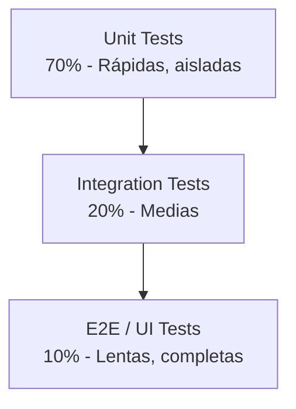

- [1. Introducción: La Cultura del QA en el Despliegue](#1-introducción-la-cultura-del-qa-en-el-despliegue)
  - [1.1. ¿Por qué importa la Verificación y Validación?](#11-por-qué-importa-la-verificación-y-validación)
  - [1.2. Verificación vs Validación](#12-verificación-vs-validación)
  - [1.3. La Pirámide de Tests](#13-la-pirámide-de-tests)
    - [1.3.1. Distribución Recomendada](#131-distribución-recomendada)
  - [1.4. El Coste del Error en Producción](#14-el-coste-del-error-en-producción)
  - [1.5. Analizadores de Código y Calidad](#15-analizadores-de-código-y-calidad)
  - [1.6. Testing en el Contexto del Despliegue](#16-testing-en-el-contexto-del-despliegue)

# 1. Introducción: La Cultura del QA en el Despliegue

## 1.1. ¿Por qué importa la Verificación y Validación?

En el mundo del desarrollo de software moderno, **desplegar no es suficiente**. Una aplicación puede compilar correctamente, ejecutarse sin errores evidentes y aún así no cumplir con las expectativas del usuario o contener fallos críticos que solo aparecen en producción. 

La **Verificación y Validación** (V&V) son dos pilares fundamentales que garantizan no solo que el software funcione, sino que funcione **correctamente** y **como se espera**. 

## 1.2. Verificación vs Validación

Aunque a menudo se utilizan indistintamente, estos términos tienen significados distintos:

| Concepto         | Pregunta Clave                                   | Enfoque                                                            |
| ---------------- | ------------------------------------------------ | ------------------------------------------------------------------ |
| **Verificación** | ¿Estamos construyendo el producto correctamente? | Comprueba que el software cumple con las especificaciones técnicas |
| **Validación**   | ¿Estamos construyendo el producto correcto?      | Verifica que el software satisface las necesidades del usuario     |

**Ejemplo práctico:**

Imagina que desarrollas un sistema de login: 

- **Verificación**: ¿El método `hashPassword()` utiliza SHA-256 como especifica la documentación técnica? 
- **Validación**: ¿El usuario puede acceder a su cuenta de forma intuitiva y segura? 

## 1.3. La Pirámide de Tests

La industria del software ha consolidado un modelo conceptual conocido como **la Pirámide de Tests**, que establece la proporción ideal de tipos de pruebas:

### 1.3.1. Distribución Recomendada

1. **Pruebas Unitarias (70%)**: Rápidas, aisladas, enfocadas en funciones individuales
2. **Pruebas de Integración (20%)**: Verifican la comunicación entre componentes
3. **Pruebas E2E (10%)**: Simulan el comportamiento completo del usuario

## 1.4. El Coste del Error en Producción

Los estudios de la industria demuestran que **el coste de corregir un bug crece exponencialmente** según la fase en que se detecta:

| Fase de Detección | Coste Relativo | Tiempo de Corrección        |
| ----------------- | -------------- | --------------------------- |
| Desarrollo        | 1x             | Minutos                     |
| Testing           | 10x            | Horas                       |
| Staging           | 50x            | Días                        |
| Producción        | 100x-1000x     | Semanas + Daño reputacional |

💡 **Nota del Profesor**: Un bug detectado en producción no solo requiere tiempo de desarrollo para corregirse, sino que involucra reuniones de crisis, análisis de impacto, comunicación con clientes afectados, posible compensación y pérdida de confianza.  Por eso, invertir en testing es **siempre** rentable.

## 1.5. Analizadores de Código y Calidad
Los analizadores de código estático y las herramientas de calidad son aliados esenciales en la estrategia de QA. Estas herramientas ayudan a identificar problemas potenciales antes de que se conviertan en errores en tiempo de ejecución. Además ayudan a mantener estándares de codificación y mejorar la mantenibilidad del código. 

SonarQube, ESLint, StyleCop, y otros son ejemplos de herramientas que pueden integrarse en el proceso de desarrollo para proporcionar retroalimentación continua sobre la calidad del código.

En el caso de proyectos en Java y .NET, estas herramientas pueden configurarse para ejecutarse automáticamente durante el proceso de integración continua (CI), asegurando que cada cambio en el código sea evaluado por su calidad antes de ser fusionado en la rama principal.

Esto no solo mejora la calidad del software, sino que también fomenta una cultura de responsabilidad y excelencia entre los desarrolladores.

## 1.6. Testing en el Contexto del Despliegue

En esta unidad no nos limitaremos a escribir tests aislados.  Vamos a integrar la verificación y validación en el **ciclo completo de despliegue**, utilizando:

- **Docker** para entornos reproducibles
- **Testcontainers** para pruebas con infraestructura real
- **Automatización** de tests en todos los niveles
- **Orquestación** de servicios complejos

Al finalizar esta unidad, serás capaz de diseñar y ejecutar una estrategia de testing completa que garantice la calidad desde el código hasta la producción.
