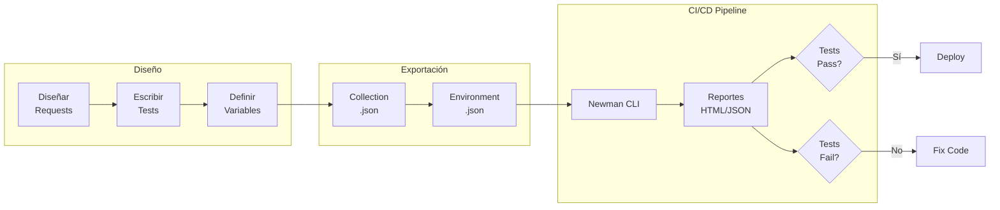
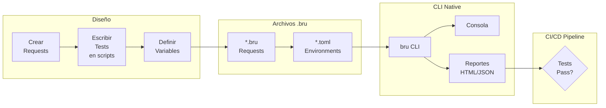
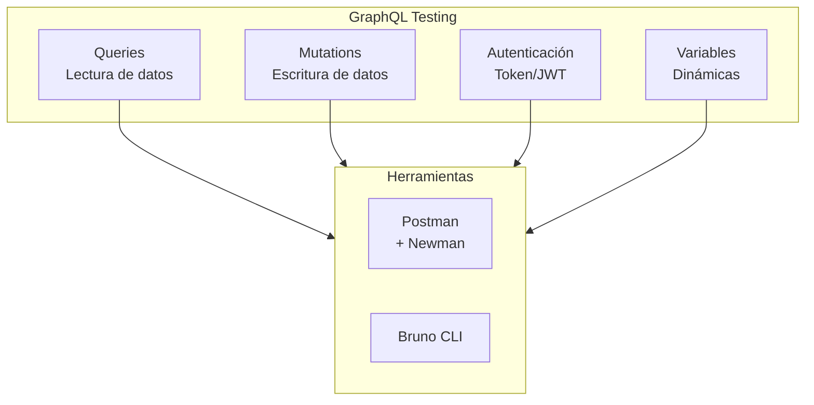

- [4. Automatización de APIs (Postman y Newman)](#4-automatización-de-apis-postman-y-newman)
  - [4.1. Guía Completa de Postman](#41-guía-completa-de-postman)
    - [4.1.1. 🛠️ Paso a Paso:  Instalación y Configuración](#411-️-paso-a-paso--instalación-y-configuración)
    - [4.1.2. Creación de Requests con Variables](#412-creación-de-requests-con-variables)
    - [4.1.3. Validación de Esquemas JSON Avanzada](#413-validación-de-esquemas-json-avanzada)
    - [4.1.4. Scripts Pre-request (Preparación)](#414-scripts-pre-request-preparación)
    - [4.1.5. Pruebas de Errores (Casos Negativos)](#415-pruebas-de-errores-casos-negativos)
    - [4.1.6. Collection-level Tests (Tests Globales)](#416-collection-level-tests-tests-globales)
    - [4.1.7. Variables de Entorno:  Desarrollo vs Producción](#417-variables-de-entorno--desarrollo-vs-producción)
  - [4. 2. Newman: CLI para Automatización](#4-2-newman-cli-para-automatización)
    - [4.2.1. 🛠️ Paso a Paso:  Instalación y Uso de Newman](#421-️-paso-a-paso--instalación-y-uso-de-newman)
    - [4.2.2. Ejecutar Tests con Newman](#422-ejecutar-tests-con-newman)
    - [4.2.3. Opciones Avanzadas de Newman](#423-opciones-avanzadas-de-newman)
    - [4.2.4. Script de Automatización Completo](#424-script-de-automatización-completo)
    - [4.2.5. Newman en Docker](#425-newman-en-docker)
    - [4.2.6. Integración con GitHub Actions](#426-integración-con-github-actions)
    - [4.2.7. Buenas Prácticas con Newman](#427-buenas-prácticas-con-newman)
  - [4.3. Bruno: Alternativa de Código Abierto a Postman](#43-bruno-alternativa-de-código-abierto-a-postman)
    - [4.3.1. 🛠️ Paso a Paso: Instalación y Configuración](#431-️-paso-a-paso-instalación-y-configuración)
    - [4.3.2. Creación de Requests con Bruno](#432-creación-de-requests-con-bruno)
    - [4.3.3. Scripts Pre-request en Bruno](#433-scripts-pre-request-en-bruno)
    - [4.3.4. Pruebas de Errores (Casos Negativos)](#434-pruebas-de-errores-casos-negativos)
    - [4.3.5. Colecciones y Tests Globales](#435-colecciones-y-tests-globales)
    - [4.3.6. Ejecutar Tests con Bruno CLI](#436-ejecutar-tests-con-bruno-cli)
    - [4.3.7. Opciones Avanzadas de Bruno CLI](#437-opciones-avanzadas-de-bruno-cli)
    - [4.3.8. Generar Reportes con Bruno](#438-generar-reportes-con-bruno)
    - [4.3.9. Script de Automatización Completo (Bruno)](#439-script-de-automatización-completo-bruno)
    - [4.3.10. Bruno en Docker](#4310-bruno-en-docker)
    - [4.3.11. Integración con GitHub Actions](#4311-integración-con-github-actions)
    - [4.3.12. Comparativa: Postman/Newman vs Bruno](#4312-comparativa-postmannewman-vs-bruno)
    - [4.3.13. Buenas Prácticas con Bruno](#4313-buenas-prácticas-con-bruno)
  - [4.4. Comparativa y Selección de Herramientas](#44-comparativa-y-selección-de-herramientas)
    - [4.4.1. Cuándo usar Postman + Newman](#441-cuándo-usar-postman--newman)
    - [4.4.2. Cuándo usar Bruno](#442-cuándo-usar-bruno)
    - [4.4.3. Recomendación del Profesor](#443-recomendación-del-profesor)


# 4. Automatización de APIs (Postman y Newman)

## 4.1. Guía Completa de Postman

**Postman** es la herramienta líder para testing de APIs REST. Permite:
- Enviar requests HTTP de cualquier tipo (GET, POST, PUT, DELETE, etc.)
- Organizar requests en **colecciones**
- Automatizar tests con **scripts JavaScript**
- Usar **variables** para diferentes entornos (dev, staging, prod)
- Ejecutar tests desde CLI con **Newman**

### 4.1.1. 🛠️ Paso a Paso:  Instalación y Configuración

**1. Instalar Postman:**
- Descargar de:  https://www.postman.com/downloads/
- O usar la versión web: https://web.postman.com/

**2. Crear Workspace:**
```
File → New Workspace → 
Name: "UD6 - Testing APIs"
Type: Personal
```

**3. Estructura de una Colección:**

```
📁 User Management API
  📁 Auth
    ├── POST Register User
    ├── POST Login
    └── POST Logout
  📁 Users
    ├── GET List All Users
    ├── GET Get User by ID
    ├── PUT Update User
    └── DELETE Delete User
  📁 Admin
    └── POST Deactivate User
```

### 4.1.2. Creación de Requests con Variables

**Variables de Entorno - Crear "Local Development":**

```json
{
  "base_url": "http://localhost:8080",
  "api_version": "v1",
  "admin_token": "",
  "user_id": "",
  "username": "testuser_{{$timestamp}}",
  "email": "test{{$timestamp}}@example.com"
}
```

💡 **Nota del Profesor**: `{{$timestamp}}` es una variable dinámica de Postman que genera un timestamp Unix. Útil para crear datos únicos en cada ejecución y evitar colisiones.

**Request 1: POST Register User**

```
Method: POST
URL: {{base_url}}/api/{{api_version}}/users/register

Headers:
  Content-Type:  application/json

Body (raw JSON):
{
  "username": "{{username}}",
  "email":  "{{email}}",
  "password": "SecurePass123!"
}
```

**Tests Tab (Scripts de Validación):**

```javascript
// Test 1: Verificar código de estado
pm.test("Status code is 201 Created", function () {
    pm.response.to.have. status(201);
});

// Test 2: Verificar tiempo de respuesta
pm.test("Response time is less than 500ms", function () {
    pm.expect(pm.response.responseTime).to.be.below(500);
});

// Test 3: Verificar estructura del response
pm.test("Response has required fields", function () {
    const jsonData = pm.response.json();
    pm.expect(jsonData).to.have.property('id');
    pm.expect(jsonData).to.have.property('username');
    pm.expect(jsonData).to.have.property('email');
    pm.expect(jsonData).to.have.property('createdAt');
});

// Test 4: Verificar que el password NO se devuelve
pm.test("Password is not exposed in response", function () {
    const jsonData = pm.response.json();
    pm.expect(jsonData).to.not.have.property('password');
});

// Test 5: Validar tipos de datos
pm.test("ID is a number", function () {
    const jsonData = pm.response.json();
    pm.expect(jsonData. id).to.be.a('number');
});

pm.test("Username matches request", function () {
    const jsonData = pm.response.json();
    const requestData = JSON.parse(pm.request.body. raw);
    pm.expect(jsonData.username).to.eql(requestData.username);
});

// Test 6: Guardar user_id para requests posteriores
pm.test("Save user ID to environment", function () {
    const jsonData = pm.response.json();
    pm.environment.set("user_id", jsonData.id);
    console.log("User ID saved:", jsonData.id);
});
```

**Request 2: POST Login (Autenticación)**

```
Method: POST
URL: {{base_url}}/api/{{api_version}}/auth/login

Body (raw JSON):
{
  "username": "{{username}}",
  "password": "SecurePass123!"
}
```

**Tests:**

```javascript
pm.test("Status code is 200 OK", function () {
    pm.response.to.have.status(200);
});

pm.test("Response contains access token", function () {
    const jsonData = pm.response.json();
    pm.expect(jsonData).to.have.property('token');
    pm.expect(jsonData.token).to.not.be.empty;
});

pm.test("Token is valid JWT format", function () {
    const jsonData = pm.response.json();
    const jwtRegex = /^[A-Za-z0-9-_]+\.[A-Za-z0-9-_]+\.[A-Za-z0-9-_]+$/;
    pm. expect(jsonData.token).to.match(jwtRegex);
});

// Guardar token para requests autenticados
pm.test("Save token to environment", function () {
    const jsonData = pm.response.json();
    pm.environment.set("admin_token", jsonData.token);
    console.log("Token saved");
});
```

**Request 3: GET Get User by ID (Autenticado)**

```
Method: GET
URL: {{base_url}}/api/{{api_version}}/users/{{user_id}}

Headers:
  Authorization: Bearer {{admin_token}}
```

**Tests:**

```javascript
pm.test("Status code is 200 OK", function () {
    pm.response.to.have.status(200);
});

pm.test("User data is correct", function () {
    const jsonData = pm.response.json();
    pm.expect(jsonData. id).to.eql(parseInt(pm.environment.get("user_id")));
    pm.expect(jsonData.username).to.eql(pm.environment.get("username"));
});

pm.test("Response schema is valid", function () {
    const schema = {
        type: "object",
        required: ["id", "username", "email", "isActive", "createdAt"],
        properties: {
            id: { type: "number" },
            username: { type: "string", minLength: 3, maxLength: 20 },
            email: { type: "string", format: "email" },
            isActive: { type: "boolean" },
            createdAt: { type: "string", format: "date-time" }
        }
    };
    
    pm.response.to.have.jsonSchema(schema);
});
```

### 4.1.3. Validación de Esquemas JSON Avanzada

**Request 4: GET List All Users**

```
Method: GET
URL: {{base_url}}/api/{{api_version}}/users? page=1&size=10

Headers:
  Authorization: Bearer {{admin_token}}
```

**Tests con Validación de Schema:**

```javascript
pm.test("Status code is 200 OK", function () {
    pm.response.to.have.status(200);
});

pm.test("Response is an array", function () {
    const jsonData = pm.response. json();
    pm.expect(jsonData).to.be.an('array');
});

pm.test("All users have valid structure", function () {
    const jsonData = pm.response.json();
    
    jsonData.forEach(function(user) {
        pm.expect(user).to.have.all.keys('id', 'username', 'email', 'isActive', 'createdAt');
        pm.expect(user.id).to.be.a('number');
        pm.expect(user. username).to.be.a('string').and.to.have.lengthOf. at.least(3);
        pm.expect(user.email).to.match(/^[^\s@]+@[^\s@]+\.[^\s@]+$/);
        pm.expect(user.isActive).to.be.a('boolean');
    });
});

pm.test("List contains our test user", function () {
    const jsonData = pm.response.json();
    const testUserId = parseInt(pm.environment. get("user_id"));
    const userExists = jsonData.some(user => user.id === testUserId);
    pm.expect(userExists).to.be.true;
});
```

### 4.1.4. Scripts Pre-request (Preparación)

A veces necesitamos generar datos dinámicos ANTES de enviar el request:

**Pre-request Script en "POST Register User":**

```javascript
// Generar username único
const randomString = Math.random().toString(36).substring(7);
pm.environment.set("username", `user_${randomString}`);

// Generar email único
pm.environment. set("email", `${randomString}@testdomain.com`);

// Generar password complejo
function generatePassword() {
    const lowercase = 'abcdefghijklmnopqrstuvwxyz';
    const uppercase = 'ABCDEFGHIJKLMNOPQRSTUVWXYZ';
    const numbers = '0123456789';
    const symbols = '!@#$%^&*';
    const allChars = lowercase + uppercase + numbers + symbols;
    
    let password = '';
    password += lowercase[Math.floor(Math.random() * lowercase.length)];
    password += uppercase[Math.floor(Math.random() * uppercase.length)];
    password += numbers[Math.floor(Math.random() * numbers.length)];
    password += symbols[Math.floor(Math.random() * symbols.length)];
    
    for (let i = 4; i < 12; i++) {
        password += allChars[Math.floor(Math.random() * allChars.length)];
    }
    
    return password. split('').sort(() => 0.5 - Math.random()).join('');
}

pm.environment.set("password", generatePassword());

console.log("Generated credentials:");
console.log("Username:", pm.environment.get("username"));
console.log("Email:", pm.environment.get("email"));
console.log("Password:", pm. environment.get("password"));
```

### 4.1.5. Pruebas de Errores (Casos Negativos)

**Request 5: POST Register User - Duplicate Username (Expected Failure)**

```
Method: POST
URL: {{base_url}}/api/{{api_version}}/users/register

Body (raw JSON):
{
  "username": "{{username}}",
  "email": "different_{{$timestamp}}@example.com",
  "password": "SecurePass123!"
}
```

**Tests:**

```javascript
pm.test("Status code is 409 Conflict", function () {
    pm.response.to.have.status(409);
});

pm.test("Error message indicates duplicate username", function () {
    const jsonData = pm.response. json();
    pm.expect(jsonData).to.have.property('error');
    pm.expect(jsonData.error).to.include('username');
    pm.expect(jsonData.error. toLowerCase()).to.match(/already exists|duplicate|taken/);
});

pm.test("Response has error structure", function () {
    const jsonData = pm.response.json();
    pm.expect(jsonData).to.have.property('error');
    pm.expect(jsonData).to.have.property('timestamp');
    pm.expect(jsonData).to.have.property('path');
});
```

**Request 6: POST Register User - Invalid Email**

```
Body (raw JSON):
{
  "username": "validuser_{{$timestamp}}",
  "email": "not-an-email",
  "password": "SecurePass123!"
}
```

**Tests:**

```javascript
pm.test("Status code is 400 Bad Request", function () {
    pm.response.to.have.status(400);
});

pm.test("Error indicates invalid email format", function () {
    const jsonData = pm.response.json();
    pm.expect(jsonData. error. toLowerCase()).to.match(/email|format|invalid/);
});
```

**Request 7: POST Register User - Short Password**

```
Body (raw JSON):
{
  "username": "validuser_{{$timestamp}}",
  "email": "valid{{$timestamp}}@example.com",
  "password": "short"
}
```

**Tests:**

```javascript
pm.test("Status code is 400 Bad Request", function () {
    pm.response.to.have.status(400);
});

pm.test("Error indicates password length requirement", function () {
    const jsonData = pm.response.json();
    pm.expect(jsonData.error.toLowerCase()).to.match(/password.*8|8.*characters/);
});
```

**Request 8: GET User - Unauthorized (No Token)**

```
Method: GET
URL: {{base_url}}/api/{{api_version}}/users/{{user_id}}

Headers:
  (Sin Authorization header)
```

**Tests:**

```javascript
pm.test("Status code is 401 Unauthorized", function () {
    pm.response.to.have.status(401);
});

pm.test("Error indicates missing authentication", function () {
    const jsonData = pm.response.json();
    pm.expect(jsonData. error. toLowerCase()).to.match(/unauthorized|token|authentication/);
});
```

### 4.1.6. Collection-level Tests (Tests Globales)

Puedes definir tests que se ejecuten para **todos** los requests de la colección:

**Configuración:**
1. Click derecho en la colección → **Edit**
2. Tab **Tests**

**Script Global:**

```javascript
// Verificar que todas las respuestas son JSON
pm.test("[Global] Content-Type is application/json", function () {
    pm.response.to.have.header("Content-Type");
    pm.expect(pm.response.headers. get("Content-Type")).to.include("application/json");
});

// Verificar headers de seguridad
pm.test("[Global] Security headers are present", function () {
    pm.response.to.have.header("X-Content-Type-Options");
    pm.response.to.have.header("X-Frame-Options");
});

// Log de todas las respuestas
console.log(`[${pm.info.requestName}] Status: ${pm. response.code} | Time: ${pm.response.responseTime}ms`);
```

### 4.1.7. Variables de Entorno:  Desarrollo vs Producción

**Environment "Local Development":**
```json
{
  "base_url":  "http://localhost:8080",
  "api_version": "v1",
  "timeout": 500
}
```

**Environment "Staging":**
```json
{
  "base_url": "https://staging-api.example.com",
  "api_version": "v1",
  "timeout": 2000
}
```

**Environment "Production":**
```json
{
  "base_url":  "https://api.example.com",
  "api_version":  "v1",
  "timeout": 3000
}
```

Cambiar entre ambientes:  Click en el dropdown superior derecho → Seleccionar entorno. 

💡 **Nota del Profesor**:  NUNCA guardes tokens o credenciales reales en entornos de Postman si usas workspaces compartidos. Usa variables locales o archivos de configuración externos.

---

## 4. 2. Newman: CLI para Automatización



**Newman** es el runner de línea de comandos de Postman.  Permite ejecutar colecciones en:
- Pipelines CI/CD (GitHub Actions, GitLab CI, Jenkins)
- Contenedores Docker
- Scripts de automatización
- Pruebas de regresión programadas

### 4.2.1. 🛠️ Paso a Paso:  Instalación y Uso de Newman

**1. Instalar Newman globalmente:**

```bash
npm install -g newman
```

**Verificar instalación:**
```bash
newman --version
# newman/6.1.1
```

**2. Exportar Colección de Postman:**

En Postman:
1. Click derecho en la colección → **Export**
2. Seleccionar **Collection v2.1**
3. Guardar como `user-management-api.postman_collection.json`

**3. Exportar Environment:**

1. Click en el ícono de entornos (arriba derecha)
2. Click en los tres puntos junto a "Local Development"
3. **Export**
4. Guardar como `local-dev.postman_environment.json`

**4. Estructura del Proyecto:**

```
proyecto-api-tests/
├── collections/
│   └── user-management-api.postman_collection.json
├── environments/
│   ├── local-dev.postman_environment.json
│   ├── staging.postman_environment.json
│   └── production.postman_environment.json
├── reports/
│   └── (reportes generados)
├── run-tests.sh
└── Dockerfile
```

### 4.2.2. Ejecutar Tests con Newman

**Comando básico:**

```bash
newman run collections/user-management-api.postman_collection.json \
  -e environments/local-dev.postman_environment.json
```

**Salida esperada:**

```
┌─────────────────────────┬──────────────────┬──────────────────┐
│                         │         executed │           failed │
├─────────────────────────┼──────────────────┼──────────────────┤
│              iterations │                1 │                0 │
├─────────────────────────┼──────────────────┼──────────────────┤
│                requests │                8 │                0 │
├─────────────────────────┼──────────────────┼──────────────────┤
│            test-scripts │               16 │                0 │
├─────────────────────────┼──────────────────┼──────────────────┤
│      prerequest-scripts │                8 │                0 │
├─────────────────────────┼──────────────────┼──────────────────┤
│              assertions │               45 │                0 │
├─────────────────────────┴──────────────────┴──────────────────┤
│ total run duration: 2.3s                                      │
├───────────────────────────────────────────────────────────────┤
│ total data received: 1.24kB (approx)                          │
├───────────────────────────────────────────────────────────────┤
│ average response time: 285ms [min: 145ms, max: 456ms, s.d.: 98ms] │
└───────────────────────────────────────────────────────────────┘
```

### 4.2.3. Opciones Avanzadas de Newman

**1. Ejecutar con iteraciones múltiples:**

```bash
newman run collections/user-management-api.postman_collection.json \
  -e environments/local-dev.postman_environment.json \
  -n 10 \
  --delay-request 200
```

Esto ejecuta toda la colección 10 veces con 200ms de pausa entre requests.

**2. Ejecutar solo una carpeta específica:**

```bash
newman run collections/user-management-api.postman_collection.json \
  -e environments/local-dev.postman_environment. json \
  --folder "Auth"
```

**3. Generar reportes HTML:**

Instalar reporter HTML:
```bash
npm install -g newman-reporter-html
```

Ejecutar con reporte: 
```bash
newman run collections/user-management-api.postman_collection.json \
  -e environments/local-dev.postman_environment.json \
  -r html \
  --reporter-html-export reports/test-report.html
```

**4. Generar reportes JSON para CI/CD:**

```bash
newman run collections/user-management-api.postman_collection.json \
  -e environments/local-dev.postman_environment. json \
  -r json \
  --reporter-json-export reports/test-results.json
```

**5. Opciones de verbosidad:**

```bash
# Modo silencioso (solo errores)
newman run collection. json -e env.json --silent

# Modo completo con detalles de cada request
newman run collection.json -e env.json --verbose

# Sin colores (para logs de CI)
newman run collection.json -e env.json --no-color
```

**6. Bailout (detener en primer fallo):**

```bash
newman run collections/user-management-api.postman_collection.json \
  -e environments/local-dev. postman_environment.json \
  --bail
```

**7. Timeout personalizado:**

```bash
newman run collections/user-management-api. postman_collection.json \
  -e environments/local-dev.postman_environment.json \
  --timeout-request 10000
```

### 4.2.4. Script de Automatización Completo

**run-tests.sh (Linux/macOS):**

```bash
#!/bin/bash

# Colores para output
GREEN='\033[0;32m'
RED='\033[0;31m'
YELLOW='\033[1;33m'
NC='\033[0m' # No Color

# Configuración
COLLECTION="collections/user-management-api.postman_collection.json"
ENVIRONMENT="environments/local-dev. postman_environment.json"
REPORTS_DIR="reports"
TIMESTAMP=$(date +"%Y%m%d_%H%M%S")
REPORT_FILE="${REPORTS_DIR}/report_${TIMESTAMP}.html"
JSON_REPORT="${REPORTS_DIR}/results_${TIMESTAMP}.json"

# Crear directorio de reportes si no existe
mkdir -p "$REPORTS_DIR"

echo -e "${YELLOW}========================================${NC}"
echo -e "${YELLOW}  Iniciando Tests de API con Newman${NC}"
echo -e "${YELLOW}========================================${NC}"
echo ""

# Verificar que el backend está corriendo
echo -e "${YELLOW}Verificando que el backend está activo...${NC}"
if curl -s -o /dev/null -w "%{http_code}" http://localhost:8080/actuator/health | grep -q "200"; then
    echo -e "${GREEN}✓ Backend activo${NC}"
else
    echo -e "${RED}✗ Backend no responde en http://localhost:8080${NC}"
    echo -e "${RED}  Por favor inicia el backend antes de ejecutar los tests${NC}"
    exit 1
fi

echo ""

# Ejecutar Newman
echo -e "${YELLOW}Ejecutando colección de tests...${NC}"
newman run "$COLLECTION" \
  -e "$ENVIRONMENT" \
  -r html,json,cli \
  --reporter-html-export "$REPORT_FILE" \
  --reporter-json-export "$JSON_REPORT" \
  --color on \
  --delay-request 100

# Capturar código de salida
EXIT_CODE=$?

echo ""
echo -e "${YELLOW}========================================${NC}"

# Evaluar resultado
if [ $EXIT_CODE -eq 0 ]; then
    echo -e "${GREEN}✓ TODOS LOS TESTS PASARON${NC}"
    echo -e "${GREEN}  Reporte HTML:  $REPORT_FILE${NC}"
    
    # Extraer métricas del JSON
    TOTAL_TESTS=$(jq '.run.stats.assertions. total' "$JSON_REPORT")
    FAILED_TESTS=$(jq '.run.stats.assertions.failed' "$JSON_REPORT")
    AVG_RESPONSE=$(jq '.run.timings.responseAverage' "$JSON_REPORT")
    
    echo ""
    echo -e "Métricas:"
    echo -e "  Total de aserciones: $TOTAL_TESTS"
    echo -e "  Aserciones fallidas: $FAILED_TESTS"
    echo -e "  Tiempo promedio de respuesta: ${AVG_RESPONSE}ms"
else
    echo -e "${RED}✗ ALGUNOS TESTS FALLARON${NC}"
    echo -e "${RED}  Revisa el reporte:  $REPORT_FILE${NC}"
fi

echo -e "${YELLOW}========================================${NC}"

exit $EXIT_CODE
```

**run-tests.ps1 (Windows PowerShell):**

```powershell
# Configuración
$COLLECTION = "collections\user-management-api.postman_collection.json"
$ENVIRONMENT = "environments\local-dev.postman_environment.json"
$REPORTS_DIR = "reports"
$TIMESTAMP = Get-Date -Format "yyyyMMdd_HHmmss"
$REPORT_FILE = "$REPORTS_DIR\report_$TIMESTAMP.html"
$JSON_REPORT = "$REPORTS_DIR\results_$TIMESTAMP.json"

# Crear directorio de reportes
New-Item -ItemType Directory -Force -Path $REPORTS_DIR | Out-Null

Write-Host "========================================" -ForegroundColor Yellow
Write-Host "  Iniciando Tests de API con Newman" -ForegroundColor Yellow
Write-Host "========================================" -ForegroundColor Yellow
Write-Host ""

# Verificar backend
Write-Host "Verificando que el backend está activo..." -ForegroundColor Yellow
try {
    $response = Invoke-WebRequest -Uri "http://localhost:8080/actuator/health" -Method Get -TimeoutSec 5
    if ($response.StatusCode -eq 200) {
        Write-Host "✓ Backend activo" -ForegroundColor Green
    }
} catch {
    Write-Host "✗ Backend no responde en http://localhost:8080" -ForegroundColor Red
    Write-Host "  Por favor inicia el backend antes de ejecutar los tests" -ForegroundColor Red
    exit 1
}

Write-Host ""

# Ejecutar Newman
Write-Host "Ejecutando colección de tests..." -ForegroundColor Yellow
newman run $COLLECTION `
  -e $ENVIRONMENT `
  -r html,json,cli `
  --reporter-html-export $REPORT_FILE `
  --reporter-json-export $JSON_REPORT `
  --color on `
  --delay-request 100

$EXIT_CODE = $LASTEXITCODE

Write-Host ""
Write-Host "=======================================" -ForegroundColor Yellow

if ($EXIT_CODE -eq 0) {
    Write-Host "✓ TODOS LOS TESTS PASARON" -ForegroundColor Green
    Write-Host "  Reporte HTML: $REPORT_FILE" -ForegroundColor Green
    
    # Extraer métricas
    $jsonContent = Get-Content $JSON_REPORT | ConvertFrom-Json
    $totalTests = $jsonContent.run.stats.assertions.total
    $failedTests = $jsonContent.run.stats.assertions.failed
    $avgResponse = [math]::Round($jsonContent. run.timings.responseAverage, 2)
    
    Write-Host ""
    Write-Host "Métricas:"
    Write-Host "  Total de aserciones: $totalTests"
    Write-Host "  Aserciones fallidas: $failedTests"
    Write-Host "  Tiempo promedio de respuesta: ${avgResponse}ms"
} else {
    Write-Host "✗ ALGUNOS TESTS FALLARON" -ForegroundColor Red
    Write-Host "  Revisa el reporte: $REPORT_FILE" -ForegroundColor Red
}

Write-Host "=======================================" -ForegroundColor Yellow

exit $EXIT_CODE
```

**Hacer ejecutable (Linux/macOS):**
```bash
chmod +x run-tests.sh
```

**Ejecutar:**
```bash
# Linux/macOS
./run-tests.sh

# Windows
.\run-tests.ps1
```

### 4.2.5. Newman en Docker

**Dockerfile:**

```dockerfile
FROM node:20-alpine

# Instalar Newman y reporters
RUN npm install -g newman newman-reporter-html newman-reporter-json

# Crear directorio de trabajo
WORKDIR /etc/newman

# Copiar colecciones y entornos
COPY collections/ ./collections/
COPY environments/ ./environments/

# Crear directorio para reportes
RUN mkdir -p reports

# Script de entrada
COPY docker-entrypoint.sh /usr/local/bin/
RUN chmod +x /usr/local/bin/docker-entrypoint.sh

ENTRYPOINT ["docker-entrypoint.sh"]
```

**docker-entrypoint.sh:**

```bash
#!/bin/sh

COLLECTION=${COLLECTION:-"collections/user-management-api.postman_collection. json"}
ENVIRONMENT=${ENVIRONMENT:-"environments/local-dev. postman_environment.json"}

echo "Running Newman with:"
echo "  Collection: $COLLECTION"
echo "  Environment: $ENVIRONMENT"
echo ""

newman run "$COLLECTION" \
  -e "$ENVIRONMENT" \
  -r html,json,cli \
  --reporter-html-export reports/report.html \
  --reporter-json-export reports/results.json \
  --color on \
  "$@"
```

**docker-compose.yml (para ejecutar tests contra servicios):**

```yaml
version: '3.8'

services:
  backend:
    image: user-management-api:latest
    ports:
      - "8080:8080"
    environment: 
      - SPRING_PROFILES_ACTIVE=test
      - DATABASE_URL=jdbc:postgresql://postgres:5432/testdb
    depends_on:
      - postgres
    healthcheck:
      test: ["CMD", "curl", "-f", "http://localhost:8080/actuator/health"]
      interval:  5s
      timeout: 3s
      retries: 10

  postgres:
    image: postgres:16-alpine
    environment:
      - POSTGRES_DB=testdb
      - POSTGRES_USER=testuser
      - POSTGRES_PASSWORD=testpass
    ports: 
      - "5432:5432"

  newman: 
    build: .
    environment:
      - COLLECTION=collections/user-management-api. postman_collection.json
      - ENVIRONMENT=environments/docker. postman_environment.json
    volumes:
      - ./reports:/etc/newman/reports
    depends_on:
      backend:
        condition: service_healthy
    command: ["--bail", "--delay-request", "200"]
```

**Ejecutar todo el stack:**

```bash
# Construir imágenes
docker-compose build

# Ejecutar tests
docker-compose up --abort-on-container-exit

# Ver resultados
ls -la reports/
```

**Limpiar después:**

```bash
docker-compose down -v
```

💡 **Nota del Profesor**:  Esta configuración es ideal para CI/CD.  Los tests se ejecutan en un entorno completamente aislado, reproducible y sin dependencias locales.  Cada pipeline execution arranca servicios limpios, ejecuta tests y destruye todo al finalizar.

### 4.2.6. Integración con GitHub Actions

**. github/workflows/api-tests.yml:**

```yaml
name: API Tests with Newman

on:
  push: 
    branches: [ main, develop ]
  pull_request: 
    branches: [ main ]

jobs:
  api-tests:
    runs-on: ubuntu-latest

    services:
      postgres:
        image: postgres:16-alpine
        env:
          POSTGRES_DB: testdb
          POSTGRES_USER: testuser
          POSTGRES_PASSWORD: testpass
        ports:
          - 5432:5432
        options: >-
          --health-cmd pg_isready
          --health-interval 10s
          --health-timeout 5s
          --health-retries 5

    steps:
      - name: Checkout code
        uses:  actions/checkout@v4

      - name: Set up Java 21
        uses: actions/setup-java@v4
        with: 
          java-version: '21'
          distribution: 'temurin'

      - name:  Build and start backend
        run: |
          ./gradlew bootJar
          java -jar build/libs/*. jar &
          sleep 30

      - name: Wait for backend to be ready
        run: |
          for i in {1..30}; do
            if curl -s http://localhost:8080/actuator/health | grep -q "UP"; then
              echo "Backend is ready"
              exit 0
            fi
            echo "Waiting for backend...  ($i/30)"
            sleep 2
          done
          echo "Backend failed to start"
          exit 1

      - name: Setup Node.js
        uses: actions/setup-node@v4
        with:
          node-version: '20'

      - name: Install Newman
        run: npm install -g newman newman-reporter-htmlextra

      - name: Run API tests
        run: |
          newman run collections/user-management-api.postman_collection.json \
            -e environments/ci-cd.postman_environment.json \
            -r htmlextra,json,cli \
            --reporter-htmlextra-export reports/report.html \
            --reporter-json-export reports/results.json \
            --bail

      - name: Upload test reports
        if: always()
        uses: actions/upload-artifact@v4
        with:
          name: newman-reports
          path: reports/

      - name: Comment PR with results
        if: github.event_name == 'pull_request'
        uses: actions/github-script@v7
        with:
          script: |
            const fs = require('fs');
            const results = JSON.parse(fs.readFileSync('reports/results.json', 'utf8'));
            
            const stats = results.run.stats;
            const summary = `
            ## 🧪 API Test Results
            
            - **Requests:** ${stats.requests.total} (${stats.requests.failed} failed)
            - **Tests:** ${stats.assertions.total} (${stats.assertions.failed} failed)
            - **Average Response Time:** ${Math.round(results.run.timings.responseAverage)}ms
            
            ${stats.assertions.failed === 0 ? '✅ All tests passed!' : '❌ Some tests failed'}
            `;
            
            github.rest.issues.createComment({
              issue_number: context.issue. number,
              owner: context.repo.owner,
              repo: context.repo.repo,
              body: summary
            });
```

### 4.2.7. Buenas Prácticas con Newman

**1. Organización de colecciones:**
- Una colección por módulo/dominio
- Carpetas para agrupar requests relacionados
- Nombres descriptivos:  "POST User Registration - Valid Data"

**2. Gestión de secretos:**
```bash
# Usar variables de entorno del sistema
newman run collection.json \
  --env-var "api_key=$API_KEY" \
  --env-var "db_password=$DB_PASSWORD"
```

**3. Data-driven testing con archivos CSV:**

**users-data.csv:**
```csv
username,email,password
john_doe,john@example.com,SecurePass123!
jane_smith,jane@example.com,MyPassword99
bob_wilson,bob@example.com,BobPass2024! 
```

**Ejecutar:**
```bash
newman run collection.json \
  -d users-data.csv \
  -n 3
```

En los requests, usa `{{username}}`, `{{email}}`, `{{password}}` y Newman iterará sobre cada fila.

**4. Captura de métricas para análisis:**

```bash
newman run collection.json \
  -e env.json \
  -r json \
  --reporter-json-export results.json

# Extraer métricas con jq
cat results.json | jq '.run.stats'
cat results.json | jq '.run.timings'
cat results.json | jq '.run.executions[].response.responseTime' | jq -s 'add/length'
```

---

## 4.3. Bruno: Alternativa de Código Abierto a Postman

**Bruno** es una herramienta de testing de APIs de código abierto, diseñada para ser más ligera y simple que Postman. Sus características principales:

- **Archivos de texto plano**: Las requests se guardan en archivos `.bru` (formato simple, versionable con Git)
- **Sin formato JSON propietario**: Mejor integración con control de versiones
- **Interfaz minimalista**: Menor consumo de recursos
- **CLI nativa**: `bru` para ejecución desde terminal (sin necesidad de Newman)
- **100% Offline**: Sin dependencias de nube
- **Código abierto**: MIT License, comunidad activa



### 4.3.1. 🛠️ Paso a Paso: Instalación y Configuración

**1. Instalar Bruno:**

- **Windows**: Descargar de https://www.usebruno.com/downloads (MSI installer)
- **macOS**: `brew install bruno` o descargar DMG
- **Linux**: Descargar AppImage o usar Snap: `snap install bruno`
- **npm** (CLI only): `npm install -g @usebruno/cli`

**Verificar instalación:**
```bash
bru --version
# @usebruno/cli v1.0.0
```

**2. Interfaz Gráfica:**

Ejecutar Bruno desde el menú de aplicaciones o terminal:
```bash
bruno
```

**3. Estructura de Proyecto:**

```
📁 user-management-api/
  📁 auth/
    ├── register.bru
    ├── login.bru
    └── logout.bru
  📁 users/
    ├── get-users.bru
    ├── get-user-by-id.bru
    ├── update-user.bru
    └── delete-user.bru
  📁 admin/
    └── deactivate-user.bru
  📁 environments/
    ├── local.bru
.bru
       ├── staging └── production.bru
  📁 scripts/
    └── setup-data.js
  📁 reports/
  bru.json
```

### 4.3.2. Creación de Requests con Bruno

**Variables de Entorno - local.bru:**

```toml
[environment.variables]
base_url = "http://localhost:8080"
api_version = "v1"
username = ""
email = ""
password = ""
admin_token = ""
user_id = ""
```

**Request 1: POST Register User (register.bru)**

```bru
meta {
  name: Register User
  description: Register a new user in the system
  author: Test Team
  created: 2024-01-15
}

post {{base_url}}/api/{{api_version}}/users/register
Content-Type: application/json

{
  "username": "{{username}}",
  "email": "{{email}}",
  "password": "{{password}}"
}

tests {
  // Test 1: Verificar código de estado
  bru.expectStatus(201);

  // Test 2: Verificar tiempo de respuesta
  bru.expectResponseTimeToBeLessThan(500);

  // Test 3: Verificar estructura del response
  const response = res.getBody();
  bru.expect(response).to.have.property('id');
  bru.expect(response).to.have.property('username');
  bru.expect(response).to.have.property('email');
  bru.expect(response).to.have.property('createdAt');

  // Test 4: Verificar que el password NO se devuelve
  bru.expect(response).to.not.have.property('password');

  // Test 5: Validar tipos de datos
  bru.expect(response.id).to.be.a('number');

  // Test 6: Guardar user_id para requests posteriores
  const userId = response.id;
  vars.set('user_id', userId);
  console.log('User ID saved:', userId);
}
```

**Request 2: POST Login (login.bru)**

```bru
meta {
  name: Login User
  description: Authenticate user and get access token
  author: Test Team
  created: 2024-01-15
}

post {{base_url}}/api/{{api_version}}/auth/login
Content-Type: application/json

{
  "username": "{{username}}",
  "password": "{{password}}"
}

tests {
  bru.expectStatus(200);

  const response = res.getBody();
  bru.expect(response).to.have.property('token');
  bru.expect(response.token).to.not.be.empty;

  // Validar formato JWT
  const jwtRegex = /^[A-Za-z0-9-_]+\.[A-Za-z0-9-_]+\.[A-Za-z0-9-_]+$/;
  bru.expect(response.token).to.match(jwtRegex);

  // Guardar token para requests autenticados
  vars.set('admin_token', response.token);
  console.log('Token saved');
}
```

**Request 3: GET Get User by ID (get-user-by-id.bru)**

```bru
meta {
  name: Get User by ID
  description: Retrieve user details by ID
  author: Test Team
  created: 2024-01-15
}

get {{base_url}}/api/{{api_version}}/users/{{user_id}}
Authorization: Bearer {{admin_token}}

tests {
  bru.expectStatus(200);

  const response = res.getBody();
  bru.expect(response.id).to.equal(parseInt(vars.get('user_id')));
  bru.expect(response.username).to.equal(vars.get('username'));

  // Validar schema JSON
  const schema = {
    type: "object",
    required: ["id", "username", "email", "isActive", "createdAt"],
    properties: {
      id: { type: "number" },
      username: { type: "string", minLength: 3, maxLength: 20 },
      email: { type: "string", format: "email" },
      isActive: { type: "boolean" },
      createdAt: { type: "string", format: "date-time" }
    }
  };

  bru.expectJsonSchema(schema);
}
```

### 4.3.3. Scripts Pre-request en Bruno

**Script en register.bru (sección script):**

```bru
meta {
  name: Register User
  description: Register a new user in the system
  author: Test Team
  created: 2024-01-15
}

script {
  // Generar username único
  const randomString = Math.random().toString(36).substring(7);
  vars.set('username', `user_${randomString}`);

  // Generar email único
  vars.set('email', `${randomString}@testdomain.com`);

  // Generar password complejo
  function generatePassword() {
    const lowercase = 'abcdefghijklmnopqrstuvwxyz';
    const uppercase = 'ABCDEFGHIJKLMNOPQRSTUVWXYZ';
    const numbers = '0123456789';
    const symbols = '!@#$%^&*';
    const allChars = lowercase + uppercase + numbers + symbols;

    let password = '';
    password += lowercase[Math.floor(Math.random() * lowercase.length)];
    password += uppercase[Math.floor(Math.random() * uppercase.length)];
    password += numbers[Math.floor(Math.random() * numbers.length)];
    password += symbols[Math.floor(Math.random() * symbols.length)];

    for (let i = 4; i < 12; i++) {
      password += allChars[Math.floor(Math.random() * allChars.length)];
    }

    return password.split('').sort(() => 0.5 - Math.random()).join('');
  }

  vars.set('password', generatePassword());

  console.log("Generated credentials:");
  console.log("Username:", vars.get('username'));
  console.log("Email:", vars.get('email'));
  console.log("Password:", vars.get('password'));
}

post {{base_url}}/api/{{api_version}}/users/register
Content-Type: application/json

{
  "username": "{{username}}",
  "email": "{{email}}",
  "password": "{{password}}"
}

tests {
  bru.expectStatus(201);
  const response = res.getBody();
  bru.expect(response).to.have.property('id');
  vars.set('user_id', response.id);
}
```

### 4.3.4. Pruebas de Errores (Casos Negativos)

**Request: POST Register User - Duplicate Username (register-duplicate.bru)**

```bru
meta {
  name: Register - Duplicate Username
  description: Test error handling for duplicate username
  author: Test Team
  created: 2024-01-15
}

post {{base_url}}/api/{{api_version}}/users/register
Content-Type: application/json

{
  "username": "{{username}}",
  "email": "different_{{$timestamp}}@example.com",
  "password": "{{password}}"
}

tests {
  bru.expectStatus(409);

  const response = res.getBody();
  bru.expect(response).to.have.property('error');
  bru.expect(response.error.toLowerCase()).to.match(/already exists|duplicate|taken/);

  // Validar estructura de error
  bru.expect(response).to.have.property('error');
  bru.expect(response).to.have.property('timestamp');
  bru.expect(response).to.have.property('path');
}
```

**Request: POST Register User - Invalid Email (register-invalid-email.bru)**

```bru
meta {
  name: Register - Invalid Email
  description: Test error handling for invalid email format
  author: Test Team
  created: 2024-01-15
}

post {{base_url}}/api/{{api_version}}/users/register
Content-Type: application/json

{
  "username": "validuser_{{$timestamp}}",
  "email": "not-an-email",
  "password": "{{password}}"
}

tests {
  bru.expectStatus(400);

  const response = res.getBody();
  bru.expect(response.error.toLowerCase()).to.match(/email|format|invalid/);
}
```

**Request: GET User - Unauthorized (get-user-unauthorized.bru)**

```bru
meta {
  name: Get User - Unauthorized
  description: Test error handling when no token is provided
  author: Test Team
  created: 2024-01-15
}

get {{base_url}}/api/{{api_version}}/users/{{user_id}}
# Sin Authorization header

tests {
  bru.expectStatus(401);

  const response = res.getBody();
  bru.expect(response.error.toLowerCase()).to.match(/unauthorized|token|authentication/);
}
```

### 4.3.5. Colecciones y Tests Globales

**bru.json (Configuración de colección):**

```json
{
  "name": "User Management API",
  "version": "1.0.0",
  "tests": {
    "global": [
      {
        "name": "Content-Type is application/json",
        "test": "res.getHeader('Content-Type').includes('application/json')"
      },
      {
        "name": "Security headers are present",
        "test": "res.hasHeader('X-Content-Type-Options') && res.hasHeader('X-Frame-Options')"
      }
    ]
  },
  "environments": [
    {
      "name": "local",
      "file": "environments/local.bru"
    },
    {
      "name": "staging",
      "file": "environments/staging.bru"
    },
    {
      "name": "production",
      "file": "environments/production.bru"
    }
  ]
}
```

### 4.3.6. Ejecutar Tests con Bruno CLI

**1. Instalar CLI de Bruno:**

```bash
npm install -g @usebruno/cli
```

**2. Estructura del proyecto para CLI:**

```
proyecto-api-tests/
├── collections/
│   └── user-management-api/
│       ├── auth/
│       │   ├── register.bru
│       │   └── login.bru
│       └── users/
│           ├── get-users.bru
│           └── get-user-by-id.bru
├── environments/
│   ├── local.bru
│   ├── staging.bru
│   └── production.bru
├── reports/
└── bru.json
```

**3. Ejecutar tests básicos:**

```bash
# Con entorno local
bru run --environment local

# Con entorno específico
bru run --environment environments/local.bru

# Especificar colección
bru run --collection collections/user-management-api

# Combinar opciones
bru run \
  --collection collections/user-management-api \
  --environment environments/local.bru
```

**Salida esperada:**

```
● Running collection: User Management API
│
├─ auth/register.bru
│  └─ POST http://localhost:8080/api/v1/users/register
│     ├─ Status: 201 Created ✓
│     ├─ Response time: 245ms ✓
│     ├─ 5 tests passed ✓
│
├─ auth/login.bru
│  └─ POST http://localhost:8080/api/v1/auth/login
│     ├─ Status: 200 OK ✓
│     ├─ Response time: 189ms ✓
│     ├─ 4 tests passed ✓
│
├─ users/get-users.bru
│  └─ GET http://localhost:8080/api/v1/users
│     ├─ Status: 200 OK ✓
│     ├─ Response time: 312ms ✓
│     ├─ 6 tests passed ✓
│
├─ users/get-user-by-id.bru
│  └─ GET http://localhost:8080/api/v1/users/1
│     ├─ Status: 200 OK ✓
│     ├─ Response time: 156ms ✓
│     └─ 4 tests passed ✓
│
└─ Results
   ├─ Requests: 4
   ├─ Passed: 4
   ├─ Failed: 0
   ├─ Total tests: 19
   ├─ Passed tests: 19
   └─ Failed tests: 0
```

### 4.3.7. Opciones Avanzadas de Bruno CLI

**1. Ejecutar tests específicos:**

```bash
# Solo una carpeta
bru run --collection collections/user-management-api --folder auth

# Solo un archivo específico
bru run collections/user-management-api/auth/register.bru

# Múltiples archivos
bru run \
  collections/user-management-api/auth/*.bru \
  collections/user-management-api/users/get-user-*.bru
```

**2. Iteraciones múltiples:**

```bash
# Ejecutar 10 veces
bru run \
  --collection collections/user-management-api \
  --environment environments/local.bru \
  --iterations 10

# Con delay entre requests
bru run \
  --collection collections/user-management-api \
  --environment environments/local.bru \
  --delay 200 \
  --iterations 5
```

**3. Variables de entorno desde línea de comandos:**

```bash
# Sobrescribir variables
bru run \
  --collection collections/user-management-api \
  --env-var "base_url=https://staging-api.example.com" \
  --env-var "api_key=$API_KEY"
```

**4. Modo verbose:**

```bash
# Mostrar detalles de cada request
bru run \
  --collection collections/user-management-api \
  --verbose

# Mostrar solo errores
bru run \
  --collection collections/user-management-api \
  --silent
```

**5. Timeout personalizado:**

```bash
bru run \
  --collection collections/user-management-api \
  --timeout 30000
```

### 4.3.8. Generar Reportes con Bruno

**1. Reporte HTML:**

```bash
# Instalar reporter HTML
npm install -g @usebruno/reporter-html

# Generar reporte HTML
bru run \
  --collection collections/user-management-api \
  --environment environments/local.bru \
  --reporter html \
  --output reports/test-report.html
```

**2. Reporte JSON:**

```bash
# Instalar reporter JSON
npm install -g @usebruno/reporter-json

# Generar reporte JSON
bru run \
  --collection collections/user-management-api \
  --environment environments/local.bru \
  --reporter json \
  --output reports/test-results.json
```

**3. Múltiples reportes simultáneamente:**

```bash
bru run \
  --collection collections/user-management-api \
  --environment environments/local.bru \
  --reporter html \
  --reporter json \
  --output-dir reports
```

**4. Reporte en consola (resumen):**

```bash
# Salida detallada en consola
bru run \
  --collection collections/user-management-api \
  --environment environments/local.bru \
  --format console

# JSON en consola
bru run \
  --collection collections/user-management-api \
  --environment environments/local.bru \
  --format json
```

### 4.3.9. Script de Automatización Completo (Bruno)

**run-tests.sh (Linux/macOS):**

```bash
#!/bin/bash

GREEN='\033[0;32m'
RED='\033[0;31m'
YELLOW='\033[1;33m'
NC='\033[0m'

COLLECTION="collections/user-management-api"
ENVIRONMENT="environments/local.bru"
REPORTS_DIR="reports"
TIMESTAMP=$(date +"%Y%m%d_%H%M%S")
REPORT_HTML="${REPORTS_DIR}/report_${TIMESTAMP}.html"
REPORT_JSON="${REPORTS_DIR}/results_${TIMESTAMP}.json"

mkdir -p "$REPORTS_DIR"

echo -e "${YELLOW}========================================${NC}"
echo -e "${YELLOW}  Iniciando Tests de API con Bruno${NC}"
echo -e "${YELLOW}========================================${NC}"
echo ""

echo -e "${YELLOW}Verificando que el backend está activo...${NC}"
if curl -s -o /dev/null -w "%{http_code}" http://localhost:8080/actuator/health | grep -q "200"; then
    echo -e "${GREEN}✓ Backend activo${NC}"
else
    echo -e "${RED}✗ Backend no responde en http://localhost:8080${NC}"
    echo -e "${RED}  Por favor inicia el backend antes de ejecutar los tests${NC}"
    exit 1
fi

echo ""

echo -e "${YELLOW}Ejecutando tests con Bruno...${NC}"
bru run \
  --collection "$COLLECTION" \
  --environment "$ENVIRONMENT" \
  --reporter html \
  --reporter json \
  --output-dir "$REPORTS_DIR" \
  --delay 100

EXIT_CODE=$?

echo ""
echo -e "${YELLOW}========================================${NC}"

if [ $EXIT_CODE -eq 0 ]; then
    echo -e "${GREEN}✓ TODOS LOS TESTS PASARON${NC}"
    echo -e "${GREEN}  Reporte HTML: ${REPORTS_DIR}/report.html${NC}"

    if [ -f "${REPORTS_DIR}/results.json" ]; then
        TOTAL_TESTS=$(cat "${REPORTS_DIR}/results.json" | jq '.summary.tests')
        FAILED_TESTS=$(cat "${REPORTS_DIR}/results.json" | jq '.summary.failed')
        AVG_RESPONSE=$(cat "${REPORTS_DIR}/results.json" | jq '.summary.duration')

        echo ""
        echo "Métricas:"
        echo "  Total de tests: $TOTAL_TESTS"
        echo "  Tests fallidos: $FAILED_TESTS"
        echo "  Tiempo promedio: ${AVG_RESPONSE}ms"
    fi
else
    echo -e "${RED}✗ ALGUNOS TESTS FALLARON${NC}"
    echo -e "${RED}  Revisa el reporte: ${REPORTS_DIR}/report.html${NC}"
fi

echo -e "${YELLOW}========================================${NC}"

exit $EXIT_CODE
```

**run-tests.ps1 (Windows PowerShell):**

```powershell
$COLLECTION = "collections\user-management-api"
$ENVIRONMENT = "environments\local.bru"
$REPORTS_DIR = "reports"
$TIMESTAMP = Get-Date -Format "yyyyMMdd_HHmmss"
$REPORT_HTML = "$REPORTS_DIR\report_$TIMESTAMP.html"
$REPORT_JSON = "$REPORTS_DIR\results_$TIMESTAMP.json"

New-Item -ItemType Directory -Force -Path $REPORTS_DIR | Out-Null

Write-Host "========================================" -ForegroundColor Yellow
Write-Host "  Iniciando Tests de API con Bruno" -ForegroundColor Yellow
Write-Host "========================================" -ForegroundColor Yellow
Write-Host ""

Write-Host "Verificando que el backend está activo..." -ForegroundColor Yellow
try {
    $response = Invoke-WebRequest -Uri "http://localhost:8080/actuator/health" -Method Get -TimeoutSec 5
    if ($response.StatusCode -eq 200) {
        Write-Host "✓ Backend activo" -ForegroundColor Green
    }
} catch {
    Write-Host "✗ Backend no responde en http://localhost:8080" -ForegroundColor Red
    Write-Host "  Por favor inicia el backend antes de ejecutar los tests" -ForegroundColor Red
    exit 1
}

Write-Host ""
Write-Host "Ejecutando tests con Bruno..." -ForegroundColor Yellow
bru run --collection $COLLECTION --environment $ENVIRONMENT --reporter html,json --output-dir $REPORTS_DIR --delay 100

$EXIT_CODE = $LASTEXITCODE

Write-Host ""
Write-Host "========================================" -ForegroundColor Yellow

if ($EXIT_CODE -eq 0) {
    Write-Host "✓ TODOS LOS TESTS PASARON" -ForegroundColor Green
    Write-Host "  Reporte HTML: $REPORTS_DIR\report.html" -ForegroundColor Green

    if (Test-Path "$REPORTS_DIR\results.json") {
        $jsonContent = Get-Content "$REPORTS_DIR\results.json" | ConvertFrom-Json
        $totalTests = $jsonContent.summary.tests
        $failedTests = $jsonContent.summary.failed
        $avgResponse = [math]::Round($jsonContent.summary.duration, 2)

        Write-Host ""
        Write-Host "Métricas:"
        Write-Host "  Total de tests: $totalTests"
        Write-Host "  Tests fallidos: $failedTests"
        Write-Host "  Tiempo promedio: ${avgResponse}ms"
    }
} else {
    Write-Host "✗ ALGUNOS TESTS FALLARON" -ForegroundColor Red
    Write-Host "  Revisa el reporte: $REPORTS_DIR\report.html" -ForegroundColor Red
}

Write-Host "========================================" -ForegroundColor Yellow

exit $EXIT_CODE
```

### 4.3.10. Bruno en Docker

**Dockerfile:**

```dockerfile
FROM node:20-alpine

# Instalar Bruno CLI
RUN npm install -g @usebruno/cli @usebruno/reporter-html @usebruno/reporter-json

# Crear directorio de trabajo
WORKDIR /etc/bruno

# Copiar colecciones y entornos
COPY collections/ ./collections/
COPY environments/ ./environments/

# Crear directorio para reportes
RUN mkdir -p reports

# Script de entrada
COPY docker-entrypoint.sh /usr/local/bin/
RUN chmod +x /usr/local/bin/docker-entrypoint.sh

ENTRYPOINT ["docker-entrypoint.sh"]
```

**docker-entrypoint.sh:**

```bash
#!/bin/sh

COLLECTION=${COLLECTION:-"collections/user-management-api"}
ENVIRONMENT=${ENVIRONMENT:-"environments/local.bru"}

echo "Running Bruno with:"
echo "  Collection: $COLLECTION"
echo "  Environment: $ENVIRONMENT"
echo ""

bru run \
  --collection "$COLLECTION" \
  --environment "$ENVIRONMENT" \
  --reporter html \
  --reporter json \
  --output-dir reports \
  "$@"
```

**docker-compose.yml:**

```yaml
version: '3.8'

services:
  backend:
    image: user-management-api:latest
    ports:
      - "8080:8080"
    environment:
      - SPRING_PROFILES_ACTIVE=test
      - DATABASE_URL=jdbc:postgresql://postgres:5432/testdb
    depends_on:
      - postgres
    healthcheck:
      test: ["CMD", "curl", "-f", "http://localhost:8080/actuator/health"]
      interval: 5s
      timeout: 3s
      retries: 10

  postgres:
    image: postgres:16-alpine
    environment:
      - POSTGRES_DB=testdb
      - POSTGRES_USER=testuser
      - POSTGRES_PASSWORD=testpass
    ports:
      - "5432:5432"

  bruno:
    build: .
    environment:
      - COLLECTION=collections/user-management-api
      - ENVIRONMENT=environments/docker.bru
    volumes:
      - ./reports:/etc/bruno/reports
    depends_on:
      backend:
        condition: service_healthy
```

**Ejecutar:**

```bash
docker-compose build
docker-compose up --abort-on-container-exit
ls -la reports/
```

### 4.3.11. Integración con GitHub Actions

**.github/workflows/api-tests-bruno.yml:**

```yaml
name: API Tests with Bruno

on:
  push:
    branches: [ main, develop ]
  pull_request:
    branches: [ main ]

jobs:
  api-tests:
    runs-on: ubuntu-latest

    services:
      postgres:
        image: postgres:16-alpine
        env:
          POSTGRES_DB: testdb
          POSTGRES_USER: testuser
          POSTGRES_PASSWORD: testpass
        ports:
          - 5432:5432
        options: >-
          --health-cmd pg_isready
          --health-interval 10s
          --health-timeout 5s
          --health-retries 5

    steps:
      - name: Checkout code
        uses: actions/checkout@v4

      - name: Set up Java 21
        uses: actions/setup-java@v4
        with:
          java-version: '21'
          distribution: 'temurin'

      - name: Build and start backend
        run: |
          ./gradlew bootJar
          java -jar build/libs/*.jar &
          sleep 30

      - name: Wait for backend to be ready
        run: |
          for i in {1..30}; do
            if curl -s http://localhost:8080/actuator/health | grep -q "UP"; then
              echo "Backend is ready"
              exit 0
            fi
            echo "Waiting for backend... ($i/30)"
            sleep 2
          done
          echo "Backend failed to start"
          exit 1

      - name: Setup Node.js
        uses: actions/setup-node@v4
        with:
          node-version: '20'

      - name: Install Bruno CLI
        run: npm install -g @usebruno/cli @usebruno/reporter-html @usebruno/reporter-json

      - name: Run API tests
        run: |
          bru run \
            --collection collections/user-management-api \
            --environment environments/ci-cd.bru \
            --reporter html \
            --reporter json \
            --output-dir reports

      - name: Upload test reports
        if: always()
        uses: actions/upload-artifact@v4
        with:
          name: bruno-reports
          path: reports/

      - name: Comment PR with results
        if: github.event_name == 'pull_request'
        uses: actions/github-script@v7
        with:
          script: |
            const fs = require('fs');
            const results = JSON.parse(fs.readFileSync('reports/results.json', 'utf8'));

            const summary = `
            ## 🧪 API Test Results (Bruno)

            - **Requests:** ${results.summary.requests} (${results.summary.failed} failed)
            - **Tests:** ${results.summary.tests} (${results.summary.assertionsFailed} failed)
            - **Duration:** ${Math.round(results.summary.duration)}ms

            ${results.summary.failed === 0 ? '✅ All tests passed!' : '❌ Some tests failed'}
            `;

            github.rest.issues.createComment({
              issue_number: context.issue.number,
              owner: context.repo.owner,
              repo: context.repo.repo,
              body: summary
            });
```

### 4.3.12. Comparativa: Postman/Newman vs Bruno

| Característica          | Postman + Newman           | Bruno                   |
| ----------------------- | -------------------------- | ----------------------- |
| **Licencia**            | Freemium (limitado gratis) | MIT (100% open source)  |
| **Formato de archivos** | JSON propietario           | Texto plano (.bru)      |
| **Versionado con Git**  | Difícil (JSON binario)     | Fácil (texto plano)     |
| **Interfaz**            | Pesada (~200MB)            | Ligera (~50MB)          |
| **Offline**             | Limitado                   | 100% offline            |
| **CLI**                 | Newman (separado)          | CLI nativa (bru)        |
| **Reportes HTML**       | newman-reporter-html       | @usebruno/reporter-html |
| **Reportes JSON**       | newman-reporter-json       | @usebruno/reporter-json |
| **Data-driven testing** | Archivos CSV               | Archivos CSV/JSON       |
| **Pre-request scripts** | JavaScript                 | JavaScript              |
| **Assertions**          | pm.test()                  | bru.expect()            |
| **Variables**           | Entornos JSON              | Archivos TOML           |
| **Docker**              | Requiere Newman image      | CLI nativa más ligera   |

### 4.3.13. Buenas Prácticas con Bruno

**1. Organización de archivos:**

```
proyecto/
├── collections/
│   ├── auth/
│   │   └── *.bru
│   ├── users/
│   │   └── *.bru
│   └── admin/
│       └── *.bru
├── environments/
│   ├── local.bru
│   ├── staging.bru
│   └── production.bru
├── data/
│   ├── users.csv
│   └── test-data.json
└── scripts/
    └── helpers.bru
```

**2. Scripts compartidos (scripts/helpers.bru):**

```bru
meta {
  name: Test Helpers
  description: Funciones helper para tests
}

script {
  /**
   * Genera un timestamp único
   */
  function getTimestamp() {
    return Date.now().toString();
  }

  /**
   * Genera un email único
   */
  function generateUniqueEmail(prefix = 'test') {
    return `${prefix}_${getTimestamp()}@test.com`;
  }

  /**
   * Valida formato JWT
   */
  function isValidJWT(token) {
    const jwtRegex = /^[A-Za-z0-9-_]+\.[A-Za-z0-9-_]+\.[A-Za-z0-9-_]+$/;
    return jwtRegex.test(token);
  }

  /**
   * Genera password seguro
   */
  function generateSecurePassword() {
    const chars = 'abcdefghijklmnopqrstuvwxyzABCDEFGHIJKLMNOPQRSTUVWXYZ0123456789!@#$%^&*';
    let password = '';
    for (let i = 0; i < 12; i++) {
      password += chars.charAt(Math.floor(Math.random() * chars.length));
    }
    return password;
  }

  // Exportar funciones
  module.exports = {
    getTimestamp,
    generateUniqueEmail,
    isValidJWT,
    generateSecurePassword
  };
}
```

**3. Data-driven testing con CSV:**

```bash
# users.csv
username,email,password
john_doe,john@example.com,SecurePass123!
jane_smith,jane@example.com,MyPassword99
bob_wilson,bob@example.com,BobPass2024!
```

```bash
bru run \
  --collection collections/user-management-api \
  --environment environments/local.bru \
  --data data/users.csv \
  --iterations 3
```

**4. Manejo de secretos:**

```bash
# Usar variables de entorno del sistema
bru run \
  --collection collections/user-management-api \
  --env-var "api_key=$API_KEY" \
  --env-var "db_password=$DB_PASSWORD"
```

---

## 4.4. Comparativa y Selección de Herramientas

### 4.4.1. Cuándo usar Postman + Newman

- **Equipo ya familiarizado** con Postman
- **Necesitas mocks, documentación automática**
- **Colaboración en equipo** con workspaces compartidos
- **Integración con Postman API Network**
- **Reportes avanzados** con newman-reporter-htmlextra

### 4.4.2. Cuándo usar Bruno

- **Enfoque en código** y versionado con Git
- **Presupuesto limitado** (herramienta gratuita)
- **Minimalismo** y rendimiento
- **100% offline** sin dependencias de nube
- **Simplicidad** en la CLI

### 4.4.3. Recomendación del Profesor

Para este curso, **recomiendo Bruno** por:
1. Formato de texto plano (fácil de versionar)
2. CLI nativa más simple que Newman
3. Completamente gratuito y open source
4. Curva de aprendizaje menor
5. Mejor integración con prácticas DevOps

Sin embargo, **Postman sigue siendo estándar en la industria** y conocer ambas herramientas te hará más versátil como QA Engineer.

---

## 4.5. Testing de APIs GraphQL

**GraphQL** es un lenguaje de consulta y runtime para APIs que permite solicitar exactamente los datos necesarios. A diferencia de REST, GraphQL usa un único endpoint y estructura las requests como consultas o mutaciones.



### 4.5.1. Conceptos Fundamentales de GraphQL

| Concepto | Descripción | Ejemplo |
|----------|-------------|---------|
| **Query** | Lectura de datos (equivalente GET) | `query { users { id name } }` |
| **Mutation** | Escritura de datos (equivalente POST/PUT/DELETE) | `mutation { createUser(input: {...}) { id } }` |
| **Schema** | Define tipos, queries y mutations disponibles | `type User { id: ID! name: String! }` |
| **Variables** | Parámetros dinámicos en queries/mutations | `$userId: ID!` |
| **Introspection** | Consulta del esquema mismo | `query { __schema { types { name } } }` |

### 4.5.2. APIs GraphQL de Ejemplo

**Countries GraphQL API (pública):**
- Endpoint: `https://countries.trevorblades.com/`
- Documentación: `https://countries.trevorblades.com/docs/`

**SpaceX GraphQL API (pública):**
- Endpoint: `https://api.spacex.land/graphql/`

**Rick and Morty API:**
- Endpoint: `https://rickandmortyapi.com/graphql`

---

## 4.6. GraphQL con Postman

### 4.6.1. Configuración Inicial

**Environment para GraphQL:**

```json
{
  "base_url": "https://countries.trevorblades.com",
  "graphql_endpoint": "https://countries.trevorblades.com/graphql",
  "spacex_endpoint": "https://api.spacex.land/graphql",
  "auth_token": "",
  "country_code": "",
  "user_id": ""
}
```

### 4.6.2. Queries sin Autenticación

**Query 1: Obtener Todos los Países**

```
POST {{graphql_endpoint}}
Content-Type: application/json
```

**Body (GraphQL):**

```graphql
query GetAllCountries {
  countries {
    code
    name
    continent {
      name
    }
    capital
    currency
    languages {
      name
    }
  }
}
```

**Tests:**

```javascript
pm.test("Status code is 200", function () {
    pm.response.to.have.status(200);
});

pm.test("Response has data.countries", function () {
    const jsonData = pm.response.json();
    pm.expect(jsonData.data).to.have.property('countries');
    pm.expect(jsonData.data.countries).to.be.an('array');
});

pm.test("Countries array is not empty", function () {
    const jsonData = pm.response.json();
    pm.expect(jsonData.data.countries.length).to.be.above(0);
});

pm.test("Each country has required fields", function () {
    const jsonData = pm.response.json();
    jsonData.data.countries.forEach(function(country) {
        pm.expect(country).to.have.property('code');
        pm.expect(country).to.have.property('name');
        pm.expect(country).to.have.property('continent');
    });
});

pm.test("Response time is acceptable", function () {
    pm.expect(pm.response.responseTime).to.be.below(3000);
});
```

**Query 2: Filtrar por Código de País**

```
POST {{graphql_endpoint}}
Content-Type: application/json
```

**Body (GraphQL):**

```graphql
query GetCountryByCode($code: ID!) {
  country(code: $code) {
    code
    name
    native
    phone
    continent {
      code
      name
    }
    capital
    currency
    languages {
      code
      name
      native
    }
    emoji
  }
}
```

**Query Variables (tab JSON):**

```json
{
  "code": "ES"
}
```

**Tests:**

```javascript
pm.test("Status code is 200", function () {
    pm.response.to.have.status(200);
});

pm.test("Country data is returned", function () {
    const jsonData = pm.response.json();
    pm.expect(jsonData.data.country).to.not.be.null;
});

pm.test("Country is Spain", function () {
    const jsonData = pm.response.json();
    pm.expect(jsonData.data.country.name).to.equal("Spain");
    pm.expect(jsonData.data.country.code).to.equal("ES");
    pm.expect(jsonData.data.country.capital).to.equal("Madrid");
});

pm.test("Country has valid phone code", function () {
    const jsonData = pm.response.json();
    pm.expect(jsonData.data.country.phone).to.include("+34");
});
```

### 4.6.3. Queries con Autenticación (SpaceX API)

**Query 3: Obtener Información de Cohetes (con Auth Header)**

```
POST {{spacex_endpoint}}
Content-Type: application/json
Authorization: Bearer {{auth_token}}
```

**Body (GraphQL):**

```graphql
query GetRockets {
  rockets {
    id
    name
    type
    active
    stages
    boosters
    cost_per_launch
    success_rate_pct
    first_flight
    company
    country
    description
  }
}
```

**Tests:**

```javascript
pm.test("Status code is 200", function () {
    pm.response.to.have.status(200);
});

pm.test("Response has data.rockets", function () {
    const jsonData = pm.response.json();
    pm.expect(jsonData.data).to.have.property('rockets');
    pm.expect(jsonData.data.rockets).to.be.an('array');
});

pm.test("Rockets have required fields", function () {
    const jsonData = pm.response.json();
    jsonData.data.rockets.forEach(function(rocket) {
        pm.expect(rocket).to.have.property('id');
        pm.expect(rocket).to.have.property('name');
        pm.expect(rocket).to.have.property('active');
    });
});

pm.test("Some rockets are active", function () {
    const jsonData = pm.response.json();
    const activeRockets = jsonData.data.rockets.filter(r => r.active);
    pm.expect(activeRockets.length).to.be.above(0);
});
```

### 4.6.4. Mutations con Autenticación

**Mutation 1: Crear Usuario/Registro (Rick and Morty API)**

```
POST https://rickandmortyapi.com/graphql
Content-Type: application/json
```

**Body (GraphQL):**

```graphql
mutation CreateCharacter($name: String!, $status: String!, $species: String!, $type: String!, $gender: String!, $origin: String!, $location: String!, $image: String!) {
  createCharacter(input: {
    name: $name
    status: $status
    species: $species
    type: $type
    gender: $gender
    origin: {
      name: $origin
    }
    location: {
      name: $location
    }
    image: $image
  }) {
    id
    name
    status
    species
  }
}
```

**Query Variables:**

```json
{
  "name": "Test User {{$timestamp}}",
  "status": "Alive",
  "species": "Human",
  "type": "",
  "gender": "Male",
  "origin": "Earth",
  "location": "Earth",
  "image": "https://rickandmortyapi.com/api/character/avatar/1.jpeg"
}
```

**Tests:**

```javascript
pm.test("Status code is 200", function () {
    pm.response.to.have.status(200);
});

pm.test("Character was created", function () {
    const jsonData = pm.response.json();
    pm.expect(jsonData.data.createCharacter).to.have.property('id');
    pm.expect(jsonData.data.createCharacter.name).to.not.be.empty;
});

pm.test("Character name matches", function () {
    const jsonData = pm.response.json();
    const requestVars = JSON.parse(pm.request.body.raw);
    pm.expect(jsonData.data.createCharacter.name).to.include("Test User");
});

pm.test("Save character ID", function () {
    const jsonData = pm.response.json();
    pm.environment.set("character_id", jsonData.data.createCharacter.id);
});
```

### 4.6.5. Mutations con Variables de Entrada

**Mutation 2: Actualizar Character**

```
POST https://rickandmortyapi.com/graphql
Content-Type: application/json
```

**Body (GraphQL):**

```graphql
mutation UpdateCharacter($id: ID!, $name: String!, $status: String!) {
  updateCharacter(id: $id, input: {
    name: $name
    status: $status
  }) {
    id
    name
    status
    species
  }
}
```

**Query Variables:**

```json
{
  "id": "{{character_id}}",
  "name": "Updated Character {{$timestamp}}",
  "status": "Dead"
}
```

**Tests:**

```javascript
pm.test("Status code is 200", function () {
    pm.response.to.have.status(200);
});

pm.test("Character was updated", function () {
    const jsonData = pm.response.json();
    pm.expect(jsonData.data.updateCharacter.name).to.include("Updated Character");
    pm.expect(jsonData.data.updateCharacter.status).to.equal("Dead");
});
```

**Mutation 3: Eliminar Character**

```
POST https://rickandmortyapi.com/graphql
Content-Type: application/json
```

**Body (GraphQL):**

```graphql
mutation DeleteCharacter($id: ID!) {
  deleteCharacter(id: $id) {
    id
    success
  }
}
```

**Query Variables:**

```json
{
  "id": "{{character_id}}"
}
```

**Tests:**

```javascript
pm.test("Status code is 200", function () {
    pm.response.to.have.status(200);
});

pm.test("Character was deleted", function () {
    const jsonData = pm.response.json();
    pm.expect(jsonData.data.deleteCharacter.success).to.be.true;
});
```

### 4.6.6. Introspection Query (Explorar Esquema)

**Query: Obtener Esquema Completo**

```
POST {{graphql_endpoint}}
Content-Type: application/json
```

**Body (GraphQL):**

```graphql
query IntrospectionQuery {
  __schema {
    queryType {
      name
      fields {
        name
        description
        args {
          name
          type {
            name
            kind
          }
        }
      }
    }
    mutationType {
      name
      fields {
        name
        description
      }
    }
    types {
      kind
      name
      description
      fields {
        name
        type {
          name
          kind
        }
      }
    }
  }
}
```

**Tests:**

```javascript
pm.test("Status code is 200", function () {
    pm.response.to.have.status(200);
});

pm.test("Schema has query type", function () {
    const jsonData = pm.response.json();
    pm.expect(jsonData.data.__schema).to.have.property('queryType');
    pm.expect(jsonData.data.__schema.queryType).to.have.property('name');
});

pm.test("Query type has fields", function () {
    const jsonData = pm.response.json();
    pm.expect(jsonData.data.__schema.queryType.fields.length).to.be.above(0);
});

pm.test("Schema lists all types", function () {
    const jsonData = pm.response.json();
    pm.expect(jsonData.data.__schema.types).to.be.an('array');
    pm.expect(jsonData.data.__schema.types.length).to.be.above(0);
});
```

### 4.6.7. Colección GraphQL Completa en Postman

```
📁 GraphQL Testing Collection
  📁 Queries - Public
    ├── Get All Countries
    ├── Get Country by Code
    └── Introspection Query
  📁 Queries - Auth Required
    ├── Get Rockets (with Token)
    └── Get Launches (with Token)
  📁 Mutations - Auth Required
    ├── Create Character
    ├── Update Character
    └── Delete Character
```

---

## 4.7. GraphQL con Bruno

### 4.7.1. Configuración de Entorno

**environments/graphql.bru:**

```toml
[environment.variables]
countries_endpoint = "https://countries.trevorblades.com/graphql"
spacex_endpoint = "https://api.spacex.land/graphql"
rickmorty_endpoint = "https://rickandmortyapi.com/graphql"
auth_token = ""
country_code = ""
character_id = ""
```

### 4.7.2. Queries sin Autenticación

**countries/get-all.bru:**

```bru
meta {
  name: Get All Countries
  description: Query all countries from GraphQL API
  author: QA Team
}

post {{countries_endpoint}}
Content-Type: application/json

{
  "query": "query GetAllCountries { countries { code name capital currency continent { name } languages { name } } }"
}

tests {
  bru.expectStatus(200);
  bru.expectResponseTimeToBeLessThan(3000);

  const response = res.getBody();
  bru.expect(response.data).to.have.property('countries');
  bru.expect(response.data.countries).to.be.an('array');
  bru.expect(response.data.countries.length).to.be.above(0);

  response.data.countries.forEach(country => {
    bru.expect(country).to.have.property('code');
    bru.expect(country).to.have.property('name');
  });
}
```

**countries/get-by-code.bru:**

```bru
meta {
  name: Get Country by Code
  description: Query specific country using variables
  author: QA Team
}

post {{countries_endpoint}}
Content-Type: application/json

{
  "query": "query GetCountryByCode($code: ID!) { country(code: $code) { code name native phone capital continent { name } currency languages { name } } }",
  "variables": {
    "code": "{{country_code}}"
  }
}

tests {
  bru.expectStatus(200);
  bru.expectResponseTimeToBeLessThan(2000);

  const response = res.getBody();
  bru.expect(response.data.country).to.not.be.null;
  bru.expect(response.data.country.code).to.equal(vars.get('country_code'));
  bru.expect(response.data.country.name).to.equal("Spain");
  bru.expect(response.data.country.capital).to.equal("Madrid");
}
```

### 4.7.3. Queries con Autenticación

**spacex/get-rockets.bru:**

```bru
meta {
  name: Get Rockets
  description: Query rockets with authentication
  author: QA Team
}

post {{spacex_endpoint}}
Content-Type: application/json
Authorization: Bearer {{auth_token}}

{
  "query": "query GetRockets { rockets { id name type active stages boosters cost_per_launch success_rate_pct first_flight company country } }"
}

tests {
  bru.expectStatus(200);
  bru.expectResponseTimeToBeLessThan(3000);

  const response = res.getBody();
  bru.expect(response.data).to.have.property('rockets');
  bru.expect(response.data.rockets).to.be.an('array');
  bru.expect(response.data.rockets.length).to.be.above(0);

  response.data.rockets.forEach(rocket => {
    bru.expect(rocket).to.have.property('id');
    bru.expect(rocket).to.have.property('name');
    bru.expect(rocket).to.have.property('active');
  });
}
```

### 4.7.4. Mutations con Autenticación

**rickmorty/create-character.bru:**

```bru
meta {
  name: Create Character
  description: Create new character via mutation
  author: QA Team
}

post {{rickmorty_endpoint}}
Content-Type: application/json

{
  "query": "mutation CreateCharacter($input: CharacterInput!) { createCharacter(input: $input) { id name status species } }",
  "variables": {
    "input": {
      "name": "Test Character {{timestamp}}",
      "status": "Alive",
      "species": "Human",
      "type": "",
      "gender": "Male",
      "origin": { "name": "Earth" },
      "location": { "name": "Earth" },
      "image": "https://rickandmortyapi.com/api/character/avatar/1.jpeg"
    }
  }
}

tests {
  bru.expectStatus(200);
  bru.expectResponseTimeToBeLessThan(3000);

  const response = res.getBody();
  bru.expect(response.data.createCharacter).to.have.property('id');
  bru.expect(response.data.createCharacter.name).to.include("Test Character");

  vars.set('character_id', response.data.createCharacter.id);
  console.log('Character ID saved:', response.data.createCharacter.id);
}
```

**rickmorty/update-character.bru:**

```bru
meta {
  name: Update Character
  description: Update character via mutation
  author: QA Team
}

post {{rickmorty_endpoint}}
Content-Type: application/json

{
  "query": "mutation UpdateCharacter($id: ID!, $input: UpdateCharacterInput!) { updateCharacter(id: $id, input: $input) { id name status species } }",
  "variables": {
    "id": "{{character_id}}",
    "input": {
      "name": "Updated Character {{timestamp}}",
      "status": "Dead"
    }
  }
}

tests {
  bru.expectStatus(200);

  const response = res.getBody();
  bru.expect(response.data.updateCharacter.name).to.include("Updated Character");
  bru.expect(response.data.updateCharacter.status).to.equal("Dead");
}
```

**rickmorty/delete-character.bru:**

```bru
meta {
  name: Delete Character
  description: Delete character via mutation
  author: QA Team
}

post {{rickmorty_endpoint}}
Content-Type: application/json

{
  "query": "mutation DeleteCharacter($id: ID!) { deleteCharacter(id: $id) { id success } }",
  "variables": {
    "id": "{{character_id}}"
  }
}

tests {
  bru.expectStatus(200);

  const response = res.getBody();
  bru.expect(response.data.deleteCharacter.success).to.be.true;
}
```

### 4.7.5. Introspection con Bruno

**schema/introspection.bru:**

```bru
meta {
  name: Schema Introspection
  description: Query GraphQL schema structure
  author: QA Team
}

post {{countries_endpoint}}
Content-Type: application/json

{
  "query": "query IntrospectionQuery { __schema { queryType { name fields { name description } } mutationType { name fields { name } } types { kind name description fields { name type { name kind } } } } }"
}

tests {
  bru.expectStatus(200);

  const response = res.getBody();
  bru.expect(response.data.__schema).to.have.property('queryType');
  bru.expect(response.data.__schema.queryType).to.have.property('name');
  bru.expect(response.data.__schema.queryType.fields.length).to.be.above(0);
  bru.expect(response.data.__schema.types).to.be.an('array');
  bru.expect(response.data.__schema.types.length).to.be.above(0);
}
```

### 4.7.6. Estructura de Proyecto Bruno para GraphQL

```
📁 graphql-testing/
├── 📁 collections/
│   ├── 📁 countries/
│   │   ├── get-all.bru
│   │   └── get-by-code.bru
│   ├── 📁 spacex/
│   │   └── get-rockets.bru
│   ├── 📁 rickmorty/
│   │   ├── create-character.bru
│   │   ├── update-character.bru
│   │   └── delete-character.bru
│   └── 📁 schema/
│       └── introspection.bru
├── 📁 environments/
│   └── graphql.bru
└── 📁 reports/
```

---

## 4.8. Ejecución de Tests GraphQL

### 4.8.1. Con Newman (Postman)

```bash
# Ejecutar colección completa
newman run collections/GraphQL-Testing.postman_collection.json \
  -e environments/graphql.postman_environment.json \
  -r html,json,cli \
  --reporter-html-export reports/graphql-report.html \
  --reporter-json-export reports/graphql-results.json \
  --verbose

# Solo queries públicas
newman run collections/GraphQL-Testing.postman_collection.json \
  -e environments/graphql.postman_environment.json \
  --folder "Queries - Public" \
  --verbose
```

### 4.8.2. Con Bruno CLI

```bash
# Ejecutar colección completa
bru run \
  --collection collections/graphql-testing \
  --environment environments/graphql.bru \
  --reporter html \
  --reporter json \
  --output-dir reports \
  --verbose

# Solo countries queries
bru run \
  --collection collections/graphql-testing/countries \
  --environment environments/graphql.bru \
  --verbose
```

### 4.8.3. Comparativa: GraphQL vs REST

| Aspecto | GraphQL | REST |
|---------|---------|------|
| **Endpoint** | Uno solo | Múltiples por recurso |
| **Método HTTP** | Solo POST | GET, POST, PUT, DELETE |
| **Data Request** | Exacta la necesaria | Todo el recurso |
| **Over-fetching** | No ocurre | Común |
| **Under-fetching** | No ocurre | Común |
| **Variables** | Tipo seguro ($variable) | Query params/Body |
| **Autenticación** | Header estándar | Header estándar |
| **Documentación** | Introspection built-in | Externas (Swagger) |
| **Caching** | Más complejo | nativo HTTP |

---

## 4.9. Buenas Prácticas en GraphQL Testing

### 1. Usar Variables en Queries

**Mal:**
```graphql
query {
  country(code: "ES") {
    name
  }
}
```

**Bien (con variables):**
```graphql
query GetCountry($code: ID!) {
  country(code: $code) {
    name
  }
}
```

### 2. Validar Tipos de Datos

```javascript
// Postman
pm.test("Country code is string", function () {
    const jsonData = pm.response.json();
    pm.expect(jsonData.data.country.code).to.be.a('string');
    pm.expect(jsonData.data.country.code.length).to.equal(2);
});
```

### 3. Manejar Errores GraphQL

```javascript
pm.test("No GraphQL errors", function () {
    const jsonData = pm.response.json();
    pm.expect(jsonData.errors).to.be.undefined;
});
```

### 4. Probar Errores Intencionados

```javascript
pm.test("Error for invalid country code", function () {
    const jsonData = pm.response.json();
    pm.expect(jsonData.errors).to.not.be.undefined;
    pm.expect(jsonData.errors[0].message).to.include("not found");
});
```

---

## 4.10. Recursos GraphQL para Testing

### APIs GraphQL Públicas para Práctica

| API | Endpoint | Descripción |
|-----|----------|-------------|
| **Countries** | `https://countries.trevorblades.com/graphql` | Info de países |
| **SpaceX** | `https://api.spacex.land/graphql/` | Datos de SpaceX |
| **Rick and Morty** | `https://rickandmortyapi.com/graphql` | Personajes de la serie |
| **Pokemon** | `https://graphql-pokemon.vercel.app/` | Datos de Pokémon |
| **GitHub** | `https://api.github.com/graphql` | Repos y usuarios |
| **Twitter** | `https://api.twitter.com/2/` | Tweets y usuarios |

### Herramientas de Desarrollo GraphQL

- **GraphQL Playground**: IDE completo para GraphQL
- **GraphiQL**: Interface de exploración integrada
- **Apollo Studio**: Plataforma de monitoring
- **Insomnia**: Cliente REST con soporte GraphQL

---

**🎯 Resumen del Bloque 4 (Ampliado):**

✅ **Postman + Newman**: Herramienta comercial completa con GUI intuitiva, Newman para CLI, reporters extensibles y amplia adopción empresarial.

✅ **Bruno**: Alternativa open source ligera, archivos de texto plano versionables, CLI nativa simple y completamente gratuita.

✅ **GraphQL Testing**: 
- Queries para lectura de datos
- Mutations para escritura
- Variables tipadas para dinamismo
- Introspection para documentación
- Token authentication en headers
- Misma estructura que REST en ambas herramientas

✅ **Ambas herramientas permiten**:
- Diseñar requests HTTP con variables
- Escribir tests automatizados
- Ejecutar desde línea de comandos
- Generar reportes HTML y JSON
- Integrar en pipelines CI/CD
- Usar contenedores Docker
- Testear APIs GraphQL indistintamente

💡 **Nota del Profesor Final del Bloque**: GraphQL representa un cambio de paradigma importante en el testing de APIs. Aunque la sintaxis difiere de REST, los conceptos fundamentales de aserciones, variables y autenticación se mantienen. Domina ambos enfoques y serás un QA Engineer completo capaz de测试 cualquier tipo de API.
