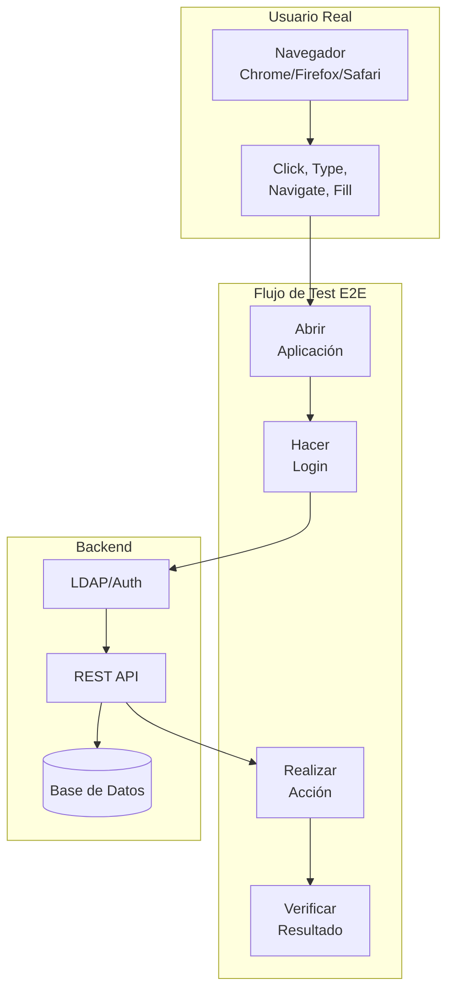
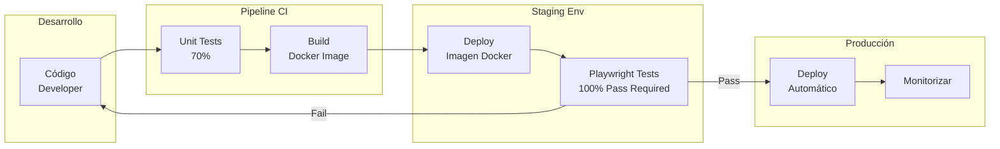

- [5. Validación de Interfaz con Playwright: La Guía Maestra Multi-Lenguaje](#5-validación-de-interfaz-con-playwright-la-guía-maestra-multi-lenguaje)
  - [5.1. Evolución Histórica y Arquitectura](#51-evolución-histórica-y-arquitectura)
    - [5.1.1. ¿Qué es el Testing E2E (End-to-End)?](#511-qué-es-el-testing-e2e-end-to-end)
    - [5.1.2. Integración en el Despliegue Moderno (CI/CD)](#512-integración-en-el-despliegue-moderno-cicd)
    - [5.1.3. Historia: De la fragilidad a la robustez](#513-historia-de-la-fragilidad-a-la-robustez)
    - [5.1.4. Comparativa Técnica Final](#514-comparativa-técnica-final)
  - [5.2. Instalación y Setup Profesional (Los Tres Entornos)](#52-instalación-y-setup-profesional-los-tres-entornos)
    - [5.2.1. 1. Node.js + TypeScript](#521-1-nodejs--typescript)
    - [5.2.2. 2. Java 25 + Gradle Kotlin DSL](#522-2-java-25--gradle-kotlin-dsl)
    - [5.2.3. 3. .NET 10 + C# 14 (NUnit)](#523-3-net-10--c-14-nunit)
    - [5.2.4. Resumen de Navegadores Disponibles](#524-resumen-de-navegadores-disponibles)
    - [5.2.5. Instalación de Navegadores Específicos](#525-instalación-de-navegadores-específicos)
  - [5.3. Localizadores (Locators): Estrategias de Selección](#53-localizadores-locators-estrategias-de-selección)
    - [5.3.1. La importancia del `data-testid`: El Contrato de QA](#531-la-importancia-del-data-testid-el-contrato-de-qa)
    - [5.3.2. Tabla Maestra de Localizadores](#532-tabla-maestra-de-localizadores)
    - [5.3.3. Truco Pro: Funciones de Extensión en C# (Sintaxis fluida)](#533-truco-pro-funciones-de-extensión-en-c-sintaxis-fluida)
  - [5.4. Comandos de Acción: Interactuando con la Web](#54-comandos-de-acción-interactuando-con-la-web)
    - [5.4.1. Descripción de Acciones Fundamentales](#541-descripción-de-acciones-fundamentales)
    - [5.4.2. Tabla Comparativa de Acciones](#542-tabla-comparativa-de-acciones)
  - [5.5. Aserciones Web-First (Inteligencia nativa)](#55-aserciones-web-first-inteligencia-nativa)
    - [5.5.1. ¿Cómo funcionan?](#551-cómo-funcionan)
    - [5.5.2. Configuración de Timeouts y Reintentos](#552-configuración-de-timeouts-y-reintentos)
    - [5.5.3. Tabla de Aserciones Comunes](#553-tabla-de-aserciones-comunes)
  - [5.6. Configuración Avanzada: Navegadores, Resoluciones y Estilos](#56-configuración-avanzada-navegadores-resoluciones-y-estilos)
    - [5.6.1. Explicación de los Parámetros de Configuración](#561-explicación-de-los-parámetros-de-configuración)
    - [5.6.2. Entorno TypeScript (`playwright.config.ts`)](#562-entorno-typescript-playwrightconfigts)
    - [5.6.3. Entorno Java 25 (`BaseTest.java`)](#563-entorno-java-25-basetestjava)
    - [5.6.4. Entorno C# 14 (`Setup.cs`)](#564-entorno-c-14-setupcs)
  - [5.7. Gestión de Evidencias Pro: Fotos, Vídeos y Trazas](#57-gestión-de-evidencias-pro-fotos-vídeos-y-trazas)
    - [5.7.1. 1. Fotos (Screenshots)](#571-1-fotos-screenshots)
    - [5.7.2. 2. Grabación de Vídeo](#572-2-grabación-de-vídeo)
    - [5.7.3. 3. Tracing (Trazas): El nivel Maestro](#573-3-tracing-trazas-el-nivel-maestro)
    - [5.7.4. 4. ¿Verlo en vivo? Modo Headed e Inspector](#574-4-verlo-en-vivo-modo-headed-e-inspector)
    - [5.7.5. Matriz de Decisión Estratégica](#575-matriz-de-decisión-estratégica)
  - [5.8. PROYECTO MAESTRO: Wikipedia Deep Search (Step-by-Step)](#58-proyecto-maestro-wikipedia-deep-search-step-by-step)
    - [5.8.1. Implementación en TypeScript (Node.js)](#581-implementación-en-typescript-nodejs)
    - [5.8.2. Implementación en Java 25 (Gradle Kotlin DSL)](#582-implementación-en-java-25-gradle-kotlin-dsl)
    - [5.8.3. Implementación en C# 14 (NUnit)](#583-implementación-en-c-14-nunit)
  - [5.9. Despliegue con Docker: Entornos Reproducibles](#59-despliegue-con-docker-entornos-reproducibles)
    - [5.9.1. ¿Por qué Docker para Playwright?](#591-por-qué-docker-para-playwright)
    - [5.9.2. Orquestación Maestra (`docker-compose.yml`)](#592-orquestación-maestra-docker-composeyml)
    - [5.9.3. Ejecución según el Lenguaje](#593-ejecución-según-el-lenguaje)
    - [5.9.4. Gestión de Resultados (Artifacts)](#594-gestión-de-resultados-artifacts)
  - [5.10. Técnicas Avanzadas de Resiliencia (Anticipando fallos reales)](#510-técnicas-avanzadas-de-resiliencia-anticipando-fallos-reales)
    - [5.10.1. 1. Bloqueo de Publicidad y Elementos Externos (Network Interception)](#5101-1-bloqueo-de-publicidad-y-elementos-externos-network-interception)
    - [5.10.2. 2. Gestión de Cookies y Consentimiento (Bypass de Overlays)](#5102-2-gestión-de-cookies-y-consentimiento-bypass-de-overlays)
    - [5.10.3. 3. Limpieza Quirúrgica del DOM (DOM Scrubbing)](#5103-3-limpieza-quirúrgica-del-dom-dom-scrubbing)
    - [5.10.4. 4. Esperas por Silencio de Red (Network Idle)](#5104-4-esperas-por-silencio-de-red-network-idle)


# 5. Validación de Interfaz con Playwright: La Guía Maestra Multi-Lenguaje


## 5.1. Evolución Histórica y Arquitectura

### 5.1.1. ¿Qué es el Testing E2E (End-to-End)?



Las pruebas de **Extremo a Extremo (E2E)** son un tipo de testeo funcional que verifica el flujo completo de una aplicación de principio a fin. A diferencia de los tests unitarios (que prueban una función) o los de integración (que prueban la unión de dos módulos), el E2E simula el comportamiento de un **usuario real** en un entorno real.

**¿Por qué es tan importante?**
*   **Visión de Conjunto:** Verifica que el Frontend, el Backend, la Base de Datos y los servicios externos (como APIs de pago o mapas) funcionen juntos correctamente.
*   **Detección de "Regresiones Visuales":** Asegura que un cambio en el CSS o en la estructura HTML no haya roto la usabilidad de un botón crítico.
*   **Confianza Total:** Es la prueba definitiva de que el producto está listo para ser usado por el cliente.

### 5.1.2. Integración en el Despliegue Moderno (CI/CD)



En una infraestructura profesional de **Integración Continua (CI)** y **Despliegue Continuo (CD)**, los tests E2E actúan como el último "Quality Gate" (puerta de calidad) antes de pasar a producción.

1.  **Pipeline de CI:** Cuando un desarrollador sube código, se ejecutan los tests unitarios. Si pasan, se construye una imagen Docker de la App.
2.  **Entorno de Staging:** Se despliega esa imagen en un entorno idéntico a producción.
3.  **Ejecución de Playwright:** Playwright lanza cientos de tests contra ese entorno en modo **Headless** (sin pantalla).
4.  **Despliegue Automático (CD):** Si el 100% de los tests E2E pasan, el sistema considera que el código es seguro y realiza el despliegue automático a producción.

**¿Por qué debe hacerse?**
Corregir un error detectado por un usuario en producción es hasta **100 veces más caro** que detectarlo en la fase de testeo. Los tests E2E automatizados con Playwright permiten desplegar varias veces al día con la seguridad de que las funcionalidades críticas (como el Login o el proceso de compra) nunca se rompan.

### 5.1.3. Historia: De la fragilidad a la robustez
1.  **Selenium (2004):** Basado en peticiones HTTP síncronas. El test no sabe si el navegador ha terminado de renderizar. Resultado: tests que fallan aleatoriamente y miles de `Thread.sleep()`.
2.  **Cypress (2015):** Se inyecta en el navegador. Muy rápido, pero vive en una "jaula": no puede tocar dos pestañas, no maneja bien los iframes de terceros y solo soporta JavaScript.
3.  **Playwright (2020):** Creado por Microsoft mediante el protocolo de WebSockets. Controla el navegador desde fuera pero con una conexión ultrarrápida. Es multi-lenguaje nativo y el más estable.

### 5.1.4. Comparativa Técnica Final

| Característica | Selenium | Cypress | **Playwright** |
| :--- | :--- | :--- | :--- |
| **Arquitectura** | HTTP Proxy (Fuera) | JS Injection (Dentro) | **WebSocket (Nativo)** |
| **Auto-Wait** | Manual (`sleep`) | Sí (limitado) | **Sí (Total)** |
| **Multi-lenguaje** | Sí | No (Solo JS/TS) | **Sí (Java, C#, TS, Py)** |
| **Multi-pestaña** | Muy complejo | No soportado | **Nativo y Sencillo** |

---

## 5.2. Instalación y Setup Profesional (Los Tres Entornos)

Playwright no es una librería "normal"; necesita descargar binarios específicos de Chromium, Firefox y WebKit (Safari). **Si solo instalas el paquete de código y no ejecutas el comando de instalación de navegadores, tus tests fallarán.**

### 5.2.1. 1. Node.js + TypeScript
Es el entorno nativo. El comando `init` crea toda la estructura por ti.

1.  **Crear el proyecto:**
    ```bash
    npm init playwright@latest
    # Selecciona: TypeScript, nombre de carpeta 'tests', sin GitHub Actions.
    ```
2.  **Instalar Navegadores:**
    ```bash
    # Instala todos (Chromium, Firefox, WebKit) y dependencias de Linux si es necesario
    npx playwright install --with-deps
    
    # Si solo quieres uno específico (ej. Firefox):
    npx playwright install firefox
    ```

### 5.2.2. 2. Java 25 + Gradle Kotlin DSL
En Java, la mejor práctica es automatizar la descarga de binarios mediante una tarea de Gradle para que cualquier compañero que baje el repo pueda instalarlos con un click.

1.  **Configurar `build.gradle.kts`:**
    ```kotlin
    dependencies {
        testImplementation("com.microsoft.playwright:playwright:1.49.0")
        testImplementation("org.junit.jupiter:junit-jupiter:5.11.0")
    }

    // Tarea personalizada para instalar navegadores desde Gradle
    tasks.register<JavaExec>("playwrightInstall") {
        mainClass.set("com.microsoft.playwright.CLI")
        classpath = sourceSets["test"].runtimeClasspath
        args = listOf("install", "--with-deps")
    }
    ```
2.  **Ejecutar Instalación:**
    ```bash
    ./gradlew playwrightInstall
    ```

### 5.2.3. 3. .NET 10 + C# 14 (NUnit)
En .NET, Playwright utiliza una herramienta de consola que se genera automáticamente en la carpeta de salida del proyecto al compilar.

1.  **Crear Proyecto y Paquetes:**
    ```bash
    dotnet new nunit -n MiProyecto.Tests
    dotnet add package Microsoft.Playwright.NUnit
    dotnet build # Crucial: Genera los scripts de instalación
    ```
2.  **Instalar Navegadores (Windows - PowerShell):**
    ```powershell
    pwsh bin/Debug/net10.0/playwright.ps1 install --with-deps
    ```
3.  **Instalar Navegadores (Linux/macOS - Bash):**
    ```bash
    ./bin/Debug/net10.0/playwright.sh install --with-deps
    ```

### 5.2.4. Resumen de Navegadores Disponibles
Por defecto, Playwright instala tres motores que cubren el 99% del mercado:
*   **Chromium:** Base de Google Chrome, Microsoft Edge, Opera y Brave.
*   **Firefox:** Motor Gecko de Mozilla.
*   **WebKit:** Motor de Apple Safari (Playwright es la única herramienta que permite testear Safari en Windows/Linux de forma nativa).

### 5.2.5. Instalación de Navegadores Específicos
Si no quieres instalar los tres motores y prefieres ahorrar espacio instalando solo **Chromium** y **WebKit**, usa estos comandos:

**En Node.js:**
```bash
npx playwright install chromium webkit --with-deps
```

**En Java (Vía Gradle):**
Si usas la tarea que definimos antes, puedes pasarle argumentos (o modificar la tarea):
```bash
# Si la tarea permite argumentos:
./gradlew playwrightInstall --args="install chromium webkit --with-deps"
```

**En .NET (CLI):**
```bash
# Windows
pwsh bin/Debug/net10.0/playwright.ps1 install chromium webkit --with-deps

# Linux/macOS
./bin/Debug/net10.0/playwright.sh install chromium webkit --with-deps
```

💡 **Nota del Profesor:** El flag `--with-deps` es fundamental en entornos Linux (como Ubuntu o WSL), ya que instala las librerías del sistema operativo necesarias para que los motores de renderizado funcionen. Sin ellas, el navegador ni siquiera se abrirá.

---

## 5.3. Localizadores (Locators): Estrategias de Selección

Un localizador es un objeto que representa una forma de encontrar elementos en la página en cualquier momento. A diferencia de Selenium, los localizadores de Playwright tienen **auto-espera y reintentos automáticos**.

### 5.3.1. La importancia del `data-testid`: El Contrato de QA
En el desarrollo profesional de aplicaciones web (DAW), los selectores basados en clases CSS (`.btn-blue`) o estructuras DOM (`div > span > button`) son **frágiles**. Si el equipo de diseño cambia el botón a rojo o añade un contenedor intermedio, el test fallará aunque la funcionalidad sea correcta.

**¿Por qué usar `data-testid`?**
*   **Desacoplamiento:** Separa la lógica de los tests de la estética (CSS) y de la funcionalidad (JS).
*   **Estabilidad:** El atributo `data-testid` es un "contrato". El desarrollador de Frontend sabe que si lo borra, romperá los tests. Por tanto, no se toca.
*   **Semántica del Caso de Uso:** En lugar de buscar un "botón azul", buscamos el `data-testid="submit-login"`. Esto mapea directamente el código del test con el requisito de negocio.
*   **Legibilidad:** El código del test describe la intención, no la implementación.

**Buenas Prácticas QA:**
1.  **Prioriza Localizadores de Usuario:** Si un elemento tiene un texto único o un rol claro (ej. botón "Pagar"), usa `GetByRole`. Es lo que un usuario real haría.
2.  **Usa `data-testid` para elementos complejos:** Si tienes una lista dinámica o elementos sin etiquetas claras, no lo dudes: añade un `data-testid` en el HTML de la aplicación.

### 5.3.2. Tabla Maestra de Localizadores

| Estrategia | Descripción | TypeScript (JS) | Java 25 | C# 14 |
| :--- | :--- | :--- | :--- | :--- |
| **Por Rol** | Elementos semánticos (botón, link). | `await page.getByRole('button')` | `page.getByRole(AriaRole.BUTTON)` | `await Page.GetByRole(AriaRole.Button)` |
| **Por Texto** | Contenido visible al usuario. | `await page.getByText('Enviar')` | `page.getByText("Enviar")` | `await Page.GetByText("Enviar")` |
| **Por Test ID** | Atributo dedicado a pruebas. | `await page.getByTestId('login')` | `page.getByTestId("login")` | `await Page.GetByTestId("login")` |
| **Por Label** | Texto de la etiqueta `<label>`. | `await page.getByLabel('Password')` | `page.getByLabel("Password")` | `await Page.GetByLabel("Password")` |
| **Placeholder** | Texto de ayuda en inputs. | `await page.getByPlaceholder('Email')` | `page.getByPlaceholder("Email")` | `await Page.GetByPlaceholder("Email")` |

### 5.3.3. Truco Pro: Funciones de Extensión en C# (Sintaxis fluida)
Crea este archivo para evitar escribir `GetByTestId` constantemente y permitir el encadenamiento:
```csharp
using Microsoft.Playwright;

public static class PlaywrightExtensions {
    public static ILocator TestId(this IPage page, string id) => page.GetByTestId(id);
    public static ILocator TestId(this ILocator locator, string id) => locator.GetByTestId(id);
}
// Uso: await Page.TestId("form").TestId("input").FillAsync("admin");
```

---

## 5.4. Comandos de Acción: Interactuando con la Web

Las acciones son la forma en que simulamos al usuario. Playwright garantiza que el test sea estable porque **espera automáticamente** a que los elementos estén listos para recibir la interacción.

### 5.4.1. Descripción de Acciones Fundamentales

1.  **Navegación (`Goto/Navigate`):** Carga una URL. Playwright espera a que la página dispare el evento `load` por defecto.
2.  **Escritura (`Fill`):** Es la forma recomendada de introducir texto. A diferencia de `type`, `fill` borra el contenido previo y escribe el nuevo de golpe, lo cual es mucho más rápido y fiable para formularios.
3.  **Clicks (`Click`):** Simula un click humano. Playwright se asegura de que el botón no esté tapado por otro elemento (como un modal) antes de pulsar.
4.  **Selección (`SelectOption`):** Se usa para menús desplegables (`<select>`). Permite seleccionar por valor, etiqueta o índice.
5.  **Checks (`Check/Uncheck`):** Específicos para checkboxes y botones de radio. Se asegura de que el elemento esté en el estado deseado sin importar su estado inicial.
6.  **Hover:** Simula pasar el ratón por encima. Vital para menús desplegables que aparecen solo al pasar el cursor o para mostrar *tooltips*.
7.  **Teclado (`Press`):** Permite simular pulsaciones de teclas físicas como `Enter`, `Escape` o combinaciones como `Control+A`.

### 5.4.2. Tabla Comparativa de Acciones

| Acción | TypeScript (JS) | Java 25 | C# 14 |
| :--- | :--- | :--- | :--- |
| **Navegar** | `await page.goto(url);` | `page.navigate(url);` | `await Page.GotoAsync(url);` |
| **Escribir** | `await loc.fill("texto");` | `loc.fill("texto");` | `await loc.FillAsync("texto");` |
| **Click** | `await loc.click();` | `loc.click();` | `await loc.ClickAsync();` |
| **Check** | `await loc.check();` | `loc.check();` | `await loc.CheckAsync();` |
| **Seleccionar** | `await loc.selectOption("1");` | `loc.selectOption("1");` | `await loc.SelectOptionAsync("1");` |
| **Hover** | `await loc.hover();` | `loc.hover();` | `await loc.HoverAsync();` |
| **Presionar** | `await loc.press("Enter");` | `loc.press("Enter");` | `await loc.PressAsync("Enter");` |

💡 **Nota del Profesor:** Recordad que en la web moderna muchas acciones ocurren de forma asíncrona. Playwright maneja esto por vosotros, pero en **TypeScript** y **C#** es obligatorio usar la palabra clave `await` para esperar a que la acción se complete antes de pasar a la siguiente línea del test. En **Java**, la librería bloquea el hilo de ejecución de forma nativa, por lo que no es necesario.

---

## 5.5. Aserciones Web-First (Inteligencia nativa)

Las **Web-First Assertions** son aserciones diseñadas específicamente para la naturaleza dinámica de la web. A diferencia de un `Assert.AreEqual` tradicional (que falla inmediatamente si el valor no coincide), las aserciones de Playwright **reintentan la comprobación** durante un periodo de tiempo hasta que la condición se cumple.

### 5.5.1. ¿Cómo funcionan?
Cuando escribes `expect(locator).toBeVisible()`, Playwright no pregunta "si es visible ahora", sino que entra en un bucle:
1.  ¿Es visible? No. -> Espera 100ms.
2.  ¿Es visible? No. -> Espera 100ms.
3.  ... (repite hasta que sea visible o se agote el tiempo).

Esto elimina la necesidad de poner esperas manuales (`Thread.sleep`) y hace que los tests sean mucho más rápidos, ya que continúan en cuanto se cumple la condición.

### 5.5.2. Configuración de Timeouts y Reintentos

El tiempo de espera por defecto es de **5 segundos**, pero se puede personalizar:

**1. A nivel de aserción individual:**
*   **TS:** `await expect(locator).toBeVisible({ timeout: 10000 });`
*   **C#:** `await Expect(locator).ToBeVisibleAsync(new() { Timeout = 10000 });`
*   **Java:** `assertThat(locator).isVisible(new LocatorAssertions.IsVisibleOptions().setTimeout(10000));`

**2. A nivel Global (Recomendado):**
Se configura en el setup del proyecto para que todos los tests sigan la misma regla.
*   **TS (`playwright.config.ts`):** `expect: { timeout: 10 * 1000 }`
*   **Java/C#:** Se define en la configuración del contexto o del objeto `Assertions`.

**3. Reintentos de Tests (Retries):**
Si un test falla (por ejemplo, por un micro-corte de red), puedes configurar Playwright para que vuelva a ejecutar el test completo antes de darlo por fallido definitivamente.
*   **TS:** `retries: 2` en el config.
*   **CI/CD:** Es una práctica común poner 2 reintentos en el servidor de despliegue para evitar falsos negativos.

### 5.5.3. Tabla de Aserciones Comunes

| Validación | Propósito | Ejemplo (TS) |
| :--- | :--- | :--- |
| `toBeVisible()` | Asegura que el usuario ve el elemento. | `await expect(loc).toBeVisible()` |
| `toContainText()` | Verifica parte del contenido de texto. | `await expect(loc).toContainText("OK")` |
| `toHaveValue()` | Comprueba el valor de un input o select. | `await expect(loc).toHaveValue("123")` |
| `toBeChecked()` | Verifica que un checkbox esté marcado. | `await expect(loc).toBeChecked()` |
| `toBeDisabled()` | Asegura que un botón no se puede pulsar. | `await expect(loc).toBeDisabled()` |

💡 **Nota del Profesor:** Recordad que las aserciones "Web-First" solo funcionan con **Localizadores**. Si extraéis el texto de un elemento manualmente y luego lo comparáis con un `assertEquals` de JUnit o NUnit, perderéis la capacidad de reintento automático y vuestros tests volverán a ser inestables. ¡Usad siempre `Expect`!

---

## 5.6. Configuración Avanzada: Navegadores, Resoluciones y Estilos

En un entorno de despliegue profesional, no podemos permitir que los tests varíen según el PC del programador. Debemos fijar cada detalle de la sesión de navegación.

### 5.6.1. Explicación de los Parámetros de Configuración

*   **Headless:** Si es `false`, se abre la ventana del navegador. Imprescindible para debugear. Si es `true`, corre en memoria (obligatorio en Docker/CI).
*   **SlowMo:** Añade un retraso (ms) entre cada acción. Útil para poder seguir con la vista qué está haciendo el test.
*   **Viewport:** Define la resolución exacta de la pantalla. Evita fallos por elementos que se ocultan en resoluciones bajas.
*   **Locale:** Fija el idioma del navegador. Vital para aplicaciones multi-idioma.
*   **TimezoneId:** Fija la zona horaria para que los tests de fechas sean consistentes.
*   **ColorScheme:** Permite forzar el modo `dark` o `light` para probar la estética de la App.
*   **RecordVideoDir:** Directorio donde se guardarán los archivos `.webm` con la grabación del test.
*   **Trace:** Graba una traza completa (red, consola, DOM) que podemos abrir después para ver qué falló paso a paso.

---

### 5.6.2. Entorno TypeScript (`playwright.config.ts`)
Fichero de configuración global para el runner nativo de Playwright.

```typescript
import { defineConfig, devices } from '@playwright/test';

export default defineConfig({
  testDir: './tests',
  fullyParallel: true,
  reporter: 'html',
  use: {
    // 1. Configuración del Navegador (Launch)
    headless: false,           // Ver navegador en vivo
    launchOptions: { 
      slowMo: 100              // Ralentiza 100ms cada acción
    },
    
    // 2. Configuración de la Sesión (Context)
    viewport: { width: 1920, height: 1080 },
    locale: 'es-ES',
    timezoneId: 'Europe/Madrid',
    colorScheme: 'dark',
    
    // 3. Captura de Evidencias
    screenshot: 'on',          // Captura siempre pantalla
    video: 'on',               // Graba siempre vídeo
    trace: 'on',               // Genera traza siempre
  },
  projects: [
    { name: 'chromium', use: { ...devices['Desktop Chrome'] } },
    { name: 'firefox', use: { ...devices['Desktop Firefox'] } },
    { name: 'webkit', use: { ...devices['Desktop Safari'] } },
  ],
});
```

---

### 5.6.3. Entorno Java 25 (`BaseTest.java`)
Clase base de la que heredarán todos nuestros tests de JUnit 5.

```java
import com.microsoft.playwright.*;
import org.junit.jupiter.api.*;
import java.nio.file.Paths;

public class BaseTest {
    protected Playwright playwright;
    protected Browser browser;
    protected BrowserContext context;
    protected Page page;

    @BeforeEach
    void setup() {
        playwright = Playwright.create();
        
        // 1. Configuración del Navegador (Launch)
        browser = playwright.chromium().launch(new BrowserType.LaunchOptions()
            .setHeadless(false)
            .setSlowMo(100));
        
        // 2. Configuración de la Sesión (Contexto)
        context = browser.newContext(new BrowserContextOptions()
            .setViewportSize(1920, 1080)
            .setLocale("es-ES")
            .setTimezoneId("Europe/Madrid")
            .setColorScheme(ColorScheme.DARK)
            .setRecordVideoDir(Paths.get("videos/"))); // Habilita grabación
            
        page = context.newPage();
    }

    @AfterEach
    void tearDown() {
        // Cerramos el contexto antes del browser para volcar el vídeo a disco
        context.close();
        browser.close();
        playwright.close();
    }
}
```

---

### 5.6.4. Entorno C# 14 (`Setup.cs`)
Configuración usando la clase base `PageTest` de NUnit.

```csharp
using Microsoft.Playwright;
using Microsoft.Playwright.NUnit;

[TestFixture]
public class MyConfiguredTests : PageTest {
    // 1. Configuración del Navegador (Launch)
    // Para cambiar navegador por consola: BROWSER=firefox dotnet test
    public override BrowserTypeLaunchOptions BrowserTypeLaunchOptions => new BrowserTypeLaunchOptions {
        Headless = false, 
        SlowMo = 100,
    };

    // 2. Configuración de la Sesión (Context)
    public override BrowserNewContextOptions ContextOptions => new BrowserNewContextOptions {
        ViewportSize = new ViewportSize { Width = 1920, Height = 1080 },
        Locale = "es-ES",
        TimeZoneId = "Europe/Madrid",
        ColorScheme = ColorScheme.Dark,
        RecordVideoDir = "videos/" // Habilita grabación
    };

    // 3. Captura de trazas (Se activa por código en el test o en el Setup)
    [SetUp]
    public async Task SetupTracing() {
        await Context.Tracing.StartAsync(new() { 
            Screenshots = true, 
            Snapshots = true, 
            Sources = true 
        });
    }

    [TearDown]
    public async Task StopTracing() {
        await Context.Tracing.StopAsync(new() { Path = "trace.zip" });
    }
}
```

---

## 5.7. Gestión de Evidencias Pro: Fotos, Vídeos y Trazas

En el despliegue continuo, las evidencias no son un lujo, son una necesidad. Playwright nos ofrece tres niveles de auditoría para reconstruir cualquier "accidente" en el servidor.

### 5.7.1. 1. Fotos (Screenshots)
Inmortalizan el estado de la web en un milisegundo exacto.
*   **Cuándo usar:** Para documentar estados exitosos o capturar errores visuales (ej. un botón que se desplaza).
*   **Por qué:** Son ligeras y fáciles de adjuntar en reportes de Jira o GitHub.

| Lenguaje | Comando de Captura |
| :--- | :--- |
| **TypeScript** | `await page.screenshot({ path: 'foto.png', fullPage: true });` |
| **Java 25** | `page.screenshot(new Page.ScreenshotOptions().setPath(Paths.get("foto.png")).setFullPage(true));` |
| **C# 14** | `await Page.ScreenshotAsync(new() { Path = "foto.png", FullPage = true });` |

### 5.7.2. 2. Grabación de Vídeo
Genera un archivo `.webm` con la película completa del test.
*   **Cuándo usar:** En tests complejos con muchas animaciones o procesos asíncronos.
*   **Por qué:** Permite detectar "race conditions" (dos cosas pasando a la vez) que una foto no puede mostrar.

**Configuración (En el Contexto):**
*   **TS:** En el config: `video: 'on-first-retry'`.
*   **Java:** `new BrowserContextOptions().setRecordVideoDir(Paths.get("videos/"))`.
*   **C#:** `new BrowserNewContextOptions { RecordVideoDir = "videos/" }`.

### 5.7.3. 3. Tracing (Trazas): El nivel Maestro
Es la "caja negra" del test. Graba cada petición de red, cada log de consola y permite explorar el DOM del pasado.
*   **Cuándo usar:** SIEMPRE en el servidor de CI/CD para tests fallidos.
*   **Por qué:** Es la única forma de debugear fallos de red o errores de backend reflejados en la consola del navegador. Se abren con `npx playwright show-trace archivo.zip`.

**Inicio y Fin de Traza:**
*   **TS:** `await context.tracing.start({ screenshots: true, snapshots: true });` ... `await context.tracing.stop({ path: 'trace.zip' });`
*   **Java:** `context.tracing().start(new Tracing.StartOptions().setScreenshots(true).setSnapshots(true));` ... `context.tracing().stop(new Tracing.StopOptions().setPath(Paths.get("trace.zip")));`
*   **C#:** `await Context.Tracing.StartAsync(new() { Screenshots = true, Snapshots = true });` ... `await Context.Tracing.StopAsync(new() { Path = "trace.zip" });`

### 5.7.4. 4. ¿Verlo en vivo? Modo Headed e Inspector
Playwright es invisible (Headless) por defecto. Para verlo como en Cypress:
1.  **Modo Headed:** Cambia la configuración a `headless: false`.
2.  **Playwright Inspector:** Lanza el test con la variable de entorno **`PWDEBUG=1`**. Se abrirá una ventana que permite ejecutar el test paso a paso, editar selectores en vivo y ver qué "piensa" Playwright en cada momento.

### 5.7.5. Matriz de Decisión Estratégica

| Herramienta | Entorno Local | CI/CD (Éxito) | CI/CD (Fallo) | Valor para QA |
| :--- | :--- | :--- | :--- | :--- |
| **Headed Mode** | ✅ Sí | ❌ No | ❌ No | Desarrollo inicial y debugging rápido. |
| **Screenshot** | ❌ No | ✅ Opcional | ✅ SÍ | Evidencia rápida del estado final. |
| **Vídeo** | ❌ No | ❌ No | ✅ SÍ | Entender flujos y tiempos de espera. |
| **Tracing** | ❌ No | ❌ No | 🔥 VITAL | Análisis forense de red, consola y DOM. |

💡 **Nota del Profesor:** Guardar vídeos y trazas de todos los tests (incluso los que pasan) llenará el disco de tu servidor de integración en horas. Configurad siempre el borrado automático o usad la opción `retain-on-failure`.

---

## 5.8. PROYECTO MAESTRO: Wikipedia Deep Search (Step-by-Step)

En este taller implementaremos un flujo profesional: **Navegación -> Cambio de Idioma -> Búsqueda -> Verificación -> Evidencias Totales**.

### 5.8.1. Implementación en TypeScript (Node.js)

1.  **Creación:** `npm init playwright@latest`
2.  **Configuración (`playwright.config.ts`):**
```typescript
import { defineConfig, devices } from '@playwright/test';
export default defineConfig({
  use: {
    headless: false,
    viewport: { width: 1920, height: 1080 },
    locale: 'es-ES',
    video: 'on',
    trace: 'on',
  },
  projects: [{ name: 'chromium', use: { ...devices['Desktop Chrome'] } }],
});
```
3.  **Test (`tests/wikipedia.spec.ts`):**
```typescript
import { test, expect } from '@playwright/test';

test('Wikipedia Spanish Search', async ({ page, context }) => {
  await context.tracing.start({ screenshots: true, snapshots: true });
  await page.goto('https://www.wikipedia.org');
  await page.getByRole('link', { name: 'Español' }).click();
  await page.locator('input[name="search"]').fill('Playwright');
  await page.keyboard.press('Enter');
  await expect(page.locator('#firstHeading')).toContainText('Playwright');
  await page.screenshot({ path: 'evidencia-ts.png' });
  await context.tracing.stop({ path: 'trace-ts.zip' });
});
```
4.  **Ejecución:** `npx playwright test`
5.  **Salida esperada:**
```text
Running 1 test using 1 worker
  1 passed (4.2s)
To open last report, run: npx playwright show-report
```

---

### 5.8.2. Implementación en Java 25 (Gradle Kotlin DSL)

1.  **Creación:** Añadir dependencias en `build.gradle.kts`.
2.  **Base de Test (`src/test/java/BaseTest.java`):**
```java
public class BaseTest {
    protected Playwright playwright;
    protected Browser browser;
    protected BrowserContext context;
    protected Page page;

    @BeforeEach
    void setup() {
        playwright = Playwright.create();
        browser = playwright.chromium().launch(new BrowserType.LaunchOptions().setHeadless(false));
        context = browser.newContext(new BrowserContextOptions()
            .setViewportSize(1920, 1080)
            .setLocale("es-ES")
            .setRecordVideoDir(Paths.get("videos/")));
        page = context.newPage();
    }
    @AfterEach
    void tearDown() { context.close(); browser.close(); playwright.close(); }
}
```
3.  **Test (`src/test/java/WikipediaTest.java`):**
```java
public class WikipediaTest extends BaseTest {
    @Test
    void testWiki() {
        context.tracing().start(new Tracing.StartOptions().setScreenshots(true).setSnapshots(true));
        page.navigate("https://www.wikipedia.org");
        page.getByRole(AriaRole.LINK, new Page.GetByRoleOptions().setName("Español")).click();
        page.locator("input[name='search']").fill("Playwright");
        page.keyboard().press("Enter");
        assertThat(page.locator("#firstHeading")).containsText("Playwright");
        page.screenshot(new Page.ScreenshotOptions().setPath(Paths.get("evidencia-java.png")));
        context.tracing().stop(new Tracing.StopOptions().setPath(Paths.get("trace-java.zip")));
    }
}
```
4.  **Ejecución:** `./gradlew test`
5.  **Salida esperada:**
```text
BUILD SUCCESSFUL in 6s
3 actionable tasks: 1 executed, 2 up-to-date
```

---

### 5.8.3. Implementación en C# 14 (NUnit)

1.  **Creación:** `dotnet new nunit` + `dotnet add package Microsoft.Playwright.NUnit`.
2.  **Setup de Configuración (`Setup.cs`):**
```csharp
[TestFixture]
public class MyConfig : PageTest {
    public override BrowserNewContextOptions ContextOptions => new BrowserNewContextOptions {
        ViewportSize = new ViewportSize { Width = 1920, Height = 1080 },
        Locale = "es-ES",
        RecordVideoDir = "videos/"
    };
}
```
3.  **Test (`WikipediaTests.cs`):**
```csharp
public class WikipediaTests : MyConfig {
    [Test]
    public async Task SearchWiki() {
        await Context.Tracing.StartAsync(new() { Screenshots = true, Snapshots = true });
        await Page.GotoAsync("https://www.wikipedia.org");
        await Page.GetByRole(AriaRole.Link, new() { Name = "Español" }).ClickAsync();
        await Page.Locator("input[name='search']").FillAsync("Playwright");
        await Page.Keyboard.PressAsync("Enter");
        await Expect(Page.Locator("#firstHeading")).ToContainTextAsync("Playwright");
        await Page.ScreenshotAsync(new() { Path = "evidencia-csharp.png" });
        await Context.Tracing.StopAsync(new() { Path = "trace-csharp.zip" });
    }
}
```
4.  **Ejecución:** `dotnet test`
5.  **Salida esperada:**
```text
Passed!  - Failed:     0, Passed:     1, Skipped:     0, Total:     1, Duration: 5 s
```

---

## 5.9. Despliegue con Docker: Entornos Reproducibles

Ejecutar tests E2E en Docker evita el problema de las librerías faltantes en servidores de integración (CI/CD). Microsoft proporciona imágenes oficiales que ya incluyen los navegadores y sus dependencias de sistema.

### 5.9.1. ¿Por qué Docker para Playwright?
1.  **Aislamiento:** No ensucias tu sistema operativo con binarios de navegadores.
2.  **Consistencia:** El test corre exactamente igual en tu PC que en el servidor de despliegue.
3.  **Dependencias:** Olvídate de instalar `libasound2` o `libnss3` manualmente; la imagen oficial ya lo tiene todo.

### 5.9.2. Orquestación Maestra (`docker-compose.yml`)
Este fichero levanta nuestra aplicación web y lanza los tests de Playwright contra ella.

```yaml
version: '3.8'
services:
  # La aplicación que queremos testear
  mi-web-app:
    image: nginx:alpine
    volumes:
      - ./dist:/usr/share/nginx/html
    ports:
      - "8080:80"
    healthcheck:
      test: ["CMD", "curl", "-f", "http://localhost"]
      interval: 5s
      timeout: 3s
      retries: 5

  # Contenedor de Tests de Playwright
  playwright-e2e:
    image: mcr.microsoft.com/playwright:v1.49.0-jammy
    working_dir: /app
    volumes:
      - .:/app
    environment:
      - BASE_URL=http://mi-web-app:80
    depends_on:
      mi-web-app:
        condition: service_healthy
    # El comando cambiará según el lenguaje (ver abajo)
    command: npx playwright test 
```

### 5.9.3. Ejecución según el Lenguaje

Para correr los tests dentro del contenedor, el comando del servicio `playwright-e2e` debe adaptarse:

1.  **TypeScript:**
    ```yaml
    command: npx playwright test
    ```
2.  **Java 25 (Gradle):**
    *Nota: Requiere que la imagen tenga JDK. Se suele usar la imagen base y añadir un `apt-get install openjdk-25-jdk`.*
    ```yaml
    command: ./gradlew test
    ```
3.  **C# 14 (.NET):**
    *Se recomienda usar la imagen específica de .NET de Playwright: `mcr.microsoft.com/playwright/dotnet:v1.49.0-jammy`.*
    ```yaml
    command: dotnet test
    ```

### 5.9.4. Gestión de Resultados (Artifacts)
Al ejecutar en Docker, los resultados (vídeos, fotos y reportes) se generan dentro del contenedor. Gracias al volumen `- .:/app`, aparecerán automáticamente en tu carpeta local:
*   **Reporte HTML:** `playwright-report/index.html`
*   **Vídeos:** Carpeta `videos/`
*   **Trazas:** Fichero `trace.zip`

**Nota del Profesor:** En Docker, los navegadores **siempre** deben correr en modo `headless: true`. Intentar abrirlos en modo visible dentro de un contenedor fallará a menos que configures un servidor X11 complejo. Para ver qué ha pasado, usad los **Vídeos** y las **Trazas**. 👨‍🏫🚀🐳

---

## 5.10. Técnicas Avanzadas de Resiliencia (Anticipando fallos reales)

En entornos profesionales, las aplicaciones web no son perfectas: cargan publicidad pesada, muestran pop-ups intrusivos o tienen latencias de red. Para que un test sea robusto aplicamos técnicas de "limpieza" y control absoluto del entorno.

### 5.10.1. 1. Bloqueo de Publicidad y Elementos Externos (Network Interception)
La técnica más potente es interceptar las peticiones de red y abortar aquellas que no son críticas (ej. Google Ads, Trackers). Esto acelera el test y evita pop-ups inesperados.

*   **TypeScript:**
    ```typescript
    await page.route('**/*google-analytics*', route => route.abort());
    await page.route('**/*.{png,jpg,jpeg}', route => route.abort());
    ```
*   **Java 25:**
    ```java
    page.route("**/*google*", route -> route.abort());
    page.route("**/*doubleclick*", route -> route.abort());
    ```
*   **C# 14:**
    ```csharp
    await Page.RouteAsync("**/*google*", async route => await route.AbortAsync());
    await Page.RouteAsync("**/*adservice*", async route => await route.AbortAsync());
    ```

### 5.10.2. 2. Gestión de Cookies y Consentimiento (Bypass de Overlays)
En lugar de programar un click en "Aceptar" en cada página, usamos la técnica de **Click Forzado**. Esto permite a Playwright interactuar con el elemento aunque un banner invisible esté bloqueando la capa superior del DOM.

*   **TypeScript:**
    ```typescript
    await page.getByRole('button', { name: 'Entrar' }).click({ force: true });
    ```
*   **Java 25:**
    ```java
    page.getByRole(AriaRole.BUTTON, new Page.GetByRoleOptions().setName("Entrar"))
        .click(new Locator.ClickOptions().setForce(true));
    ```
*   **C# 14:**
    ```csharp
    await Page.GetByRole(AriaRole.Button, new() { Name = "Entrar" })
              .ClickAsync(new() { Force = true });
    ```

### 5.10.3. 3. Limpieza Quirúrgica del DOM (DOM Scrubbing)
Si un anuncio o un banner de suscripción aparece dinámicamente, lo eliminamos directamente del HTML inyectando JavaScript. Esto garantiza que el escenario esté "limpio" antes de proceder.

*   **TypeScript:**
    ```typescript
    await page.evaluate(() => {
      document.querySelectorAll('.adsbygoogle, #promo-banner').forEach(el => el.remove());
    });
    ```
*   **Java 25:**
    ```java
    page.evaluate("() => document.querySelectorAll('.newsletter-popup').forEach(el => el.remove())");
    ```
*   **C# 14:**
    ```csharp
    await Page.EvaluateAsync(@"() => {
        const ads = document.querySelectorAll('iframe, .adsbygoogle');
        ads.forEach(ad => ad.remove());
    }");
    ```

### 5.10.4. 4. Esperas por Silencio de Red (Network Idle)
La alternativa profesional a los `sleep` es esperar a que la red esté inactiva (al menos 500ms sin nuevas peticiones), garantizando que la App ha terminado de cargar sus datos.

*   **TypeScript:**
    ```typescript
    await page.goto(url, { waitUntil: 'networkidle' });
    ```
*   **Java 25:**
    ```java
    page.navigate(url, new Page.NavigateOptions().setWaitUntil(WaitUntilState.NETWORKIDLE));
    ```
*   **C# 14:**
    ```csharp
    await Page.GotoAsync(url, new() { WaitUntil = WaitUntilState.NetworkIdle });
    ```

**Nota del Profesor:** Estas técnicas separan a un tester Junior de un **Arquitecto de QA**. Un test resiliente debe ser capaz de ejecutarse en un entorno hostil y "limpiar" su propio camino para llegar al objetivo de negocio. 🛡️