- [7. Resumen y Conclusiones](#7-resumen-y-conclusiones)
  - [7.1. Mapa Conceptual de la Unidad](#71-mapa-conceptual-de-la-unidad)
  - [7.2. Conceptos Clave Detallados](#72-conceptos-clave-detallados)
  - [7.3. Comparativa de Tipos de Pruebas](#73-comparativa-de-tipos-de-pruebas)
  - [7.4. Checklist de Supervivencia](#74-checklist-de-supervivencia)

# 7. Resumen y Conclusiones

## 7.1. Mapa Conceptual de la Unidad

```mermaid
graph TD
    UD06[UD06: Verificación y Validación] --> QA[QA y Cultura de Calidad]
    UD06 --> UNIT[Pruebas Unitarias]
    UD06 --> INTEGR[Pruebas Integración]
    UD06 --> APIs[Pruebas APIs]
    UD06 --> E2E[Pruebas E2E]
    UD06 --> INFRA[Infraestructura]

    QA --> VVS[Verificación vs Validación]
    QA --> PIR[Pirámide de Tests]
    QA --> STATIC[Análisis Estático]

    UNIT --> MOCKS[Mocks, Stubs, Spies]
    UNIT --> JVM[JUnit + Mockito]
    UNIT --> DOTNET[NUnit + Moq]
    UNIT --> COV[Cobertura JaCoCo/Coverlet]

    INTEGR --> TC[Testcontainers]
    INTEGR --> REAL[BD Reales]

    APIs --> POST[Postman]
    APIs --> NEW[Newman CLI]
    APIs --> CICD[CI/CD Integration]

    E2E --> PW[Playwright]
    E2E --> SEL[Selenium]

    INFRA --> DNS[DNS BIND9]
    INFRA --> LDAP[Directorio LDAP]
    INFRA --> ORCH[Docker Compose]
```

## 7.2. Conceptos Clave Detallados

### Verificación vs Validación

| Concepto | Pregunta | Enfoque |
|----------|----------|---------|
| **Verificación** | ¿Estamos construyendo correctamente? | Revisión técnica, tests unitarios |
| **Validación** | ¿Estamos construyendo lo correcto? | Revisión con usuario, tests E2E |

### Pirámide de Tests

La pirámide establece la distribución ideal de pruebas:
- **Unitarias (70%)**: Rápidas, aisladas, enfocadas en funciones individuales
- **Integración (20%)**: Verifican comunicación entre componentes
- **E2E (10%)**: Simulan el comportamiento completo del usuario

### Costes del Error

| Fase | Coste Relativo |
|------|----------------|
| Desarrollo | 1x |
| Testing | 10x |
| Staging | 50x |
| Producción | 100x-1000x |

### Dobles de Prueba

| Tipo | Uso |
|------|-----|
| **Mock** | Objeto simulado completo |
| **Stub** | Respuestas predefinidas |
| **Spy** | Wrapper sobre objeto real |

### Testcontainers

Permite ejecutar contenedores Docker desde tests:
- Bases de datos reales (PostgreSQL, MySQL)
- Colas de mensajes (RabbitMQ, Kafka)
- Servicios externos (Redis, Elasticsearch)

### Playwright vs Selenium

| Aspecto | Playwright | Selenium |
|---------|------------|----------|
| Velocidad | Más rápido | Más lento |
| API | Moderna | Legacy |
| Esperas | Automáticas | Manuales |
| Languages | TS, JS, Python, Java, C# | Múltiples |

## 7.3. Comparativa de Tipos de Pruebas

| Aspecto | Unitarias | Integración | E2E |
|---------|-----------|-------------|-----|
| **Velocidad** | ms | segundos | minutos |
| **Aislamiento** | Total | Parcial | Ninguno |
| **Costo por test** | Bajo | Medio | Alto |
| **Cobertura** | Funciones | Componentes | Flujos |
| **Mantenimiento** | Bajo | Medio | Alto |
| **Fallback ante errores** | Easy | Medio | Difícil |

## 7.4. Checklist de Supervivencia

Antes de dar por cerrado el tema, asegúrate de poder responder **SÍ** a estas preguntas:

- [ ] ¿Entiendo la diferencia entre verificación y validación?
- [ ] ¿Puedo explicar la pirámide de tests y su distribución?
- [ ] ¿Sé crear un test unitario con JUnit 5 y Mockito?
- [ ] ¿Conozco los principios F.I.R.S.T. del testing?
- [ ] ¿Puedo configurar Testcontainers para pruebas de integración?
- [ ] ¿Sé automatizar tests de APIs con Postman/Newman?
- [ ] ¿Puedo crear un test E2E con Playwright?
- [ ] ¿Entiendo cómo integrar tests en un pipeline CI/CD?
- [ ] ¿Conozco la diferencia entre mock, stub y spy?
- [ ] ¿Sé interpretar reportes de cobertura de código?

📝 **Nota del Profesor:** Este checklist te ayuda a verificar que dominas todos los conceptos de la UD06.

💡 **Tip del Examinador:** Las preguntas sobre diferencias entre tipos de pruebas y cuándo usar cada una son las más frecuentes.
